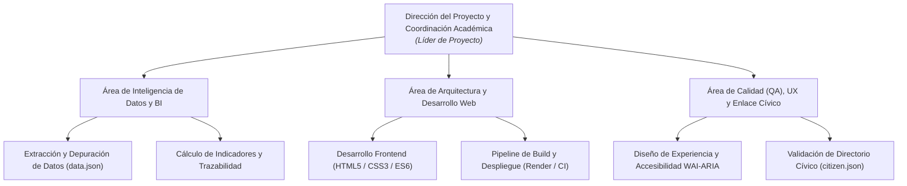
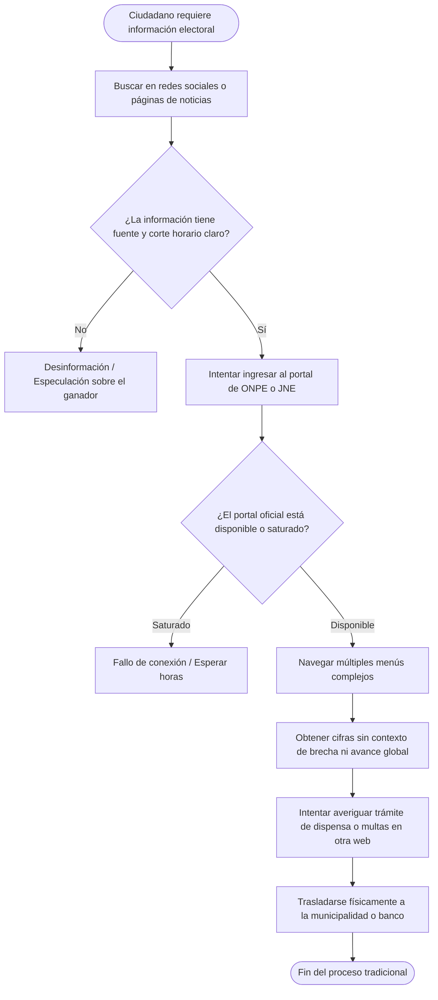
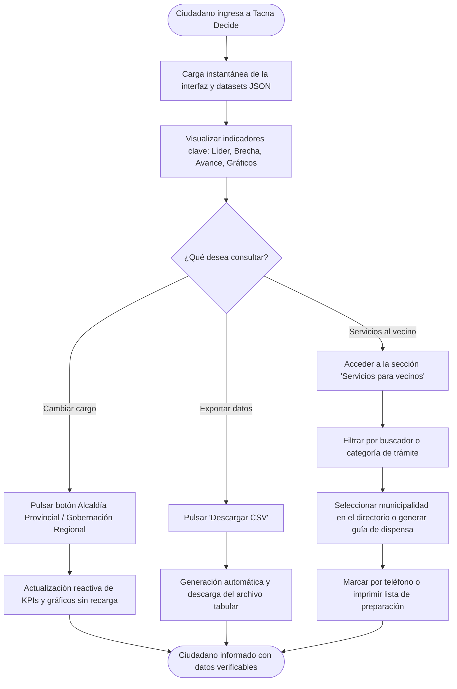
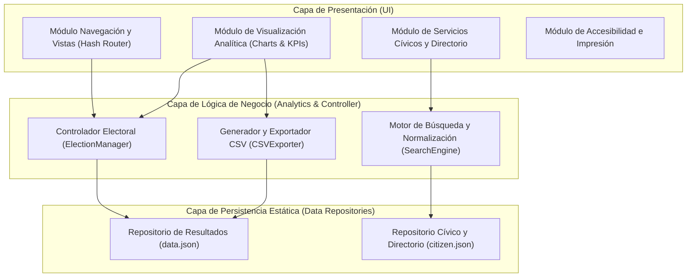
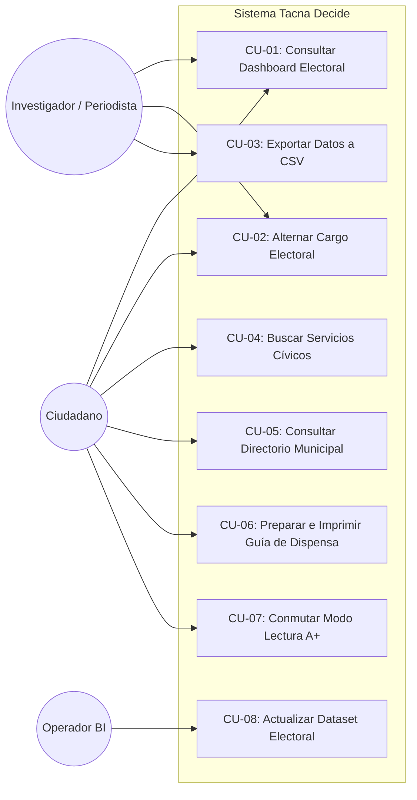
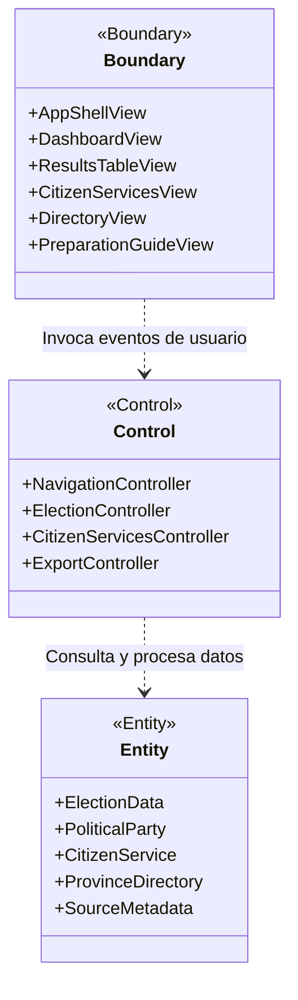
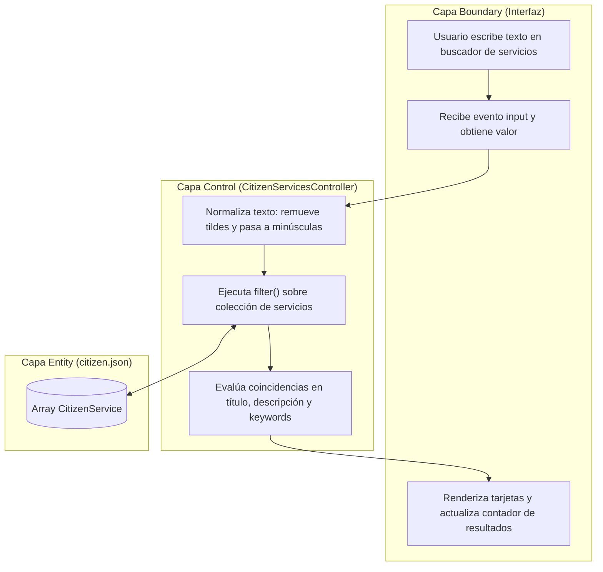
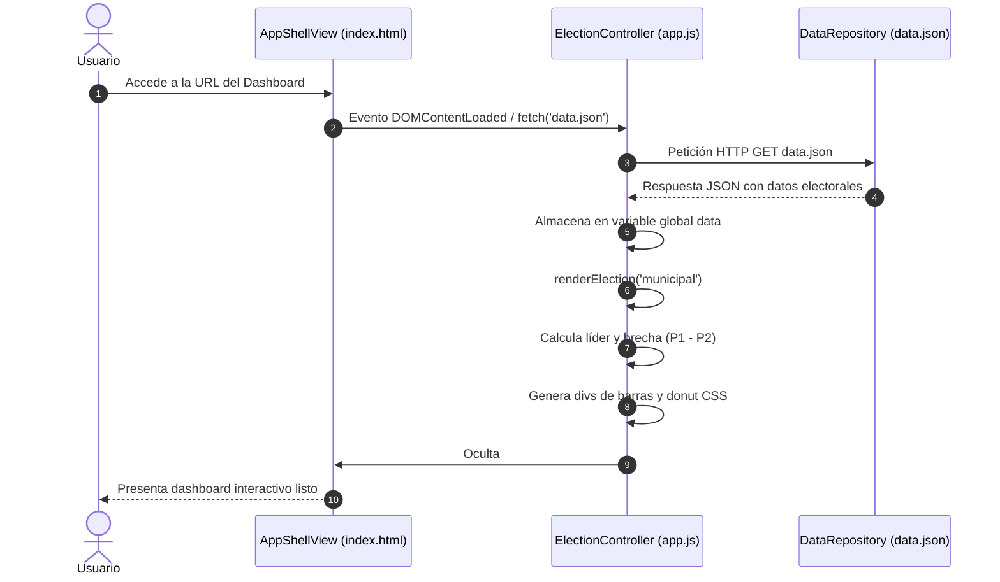
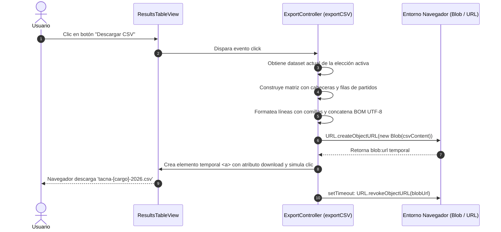
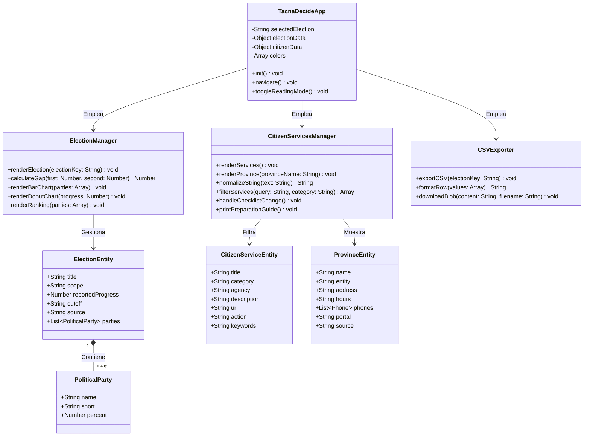

[comment]: 

**UNIVERSIDAD PRIVADA DE TACNA**

**FACULTAD DE INGENIERIA**

**Escuela Profesional de Ingeniería de Sistemas**

 

### **Proyecto *Tacna Decide — Dashboard Electoral y Observatorio de Inteligencia Cívica***

 

**Curso:** *Inteligencia de Negocios (SI-885)*

**Docente:** *Mag. Patrick José Cuadros Quiroga*

**Integrantes:**

***Vargas Candia, Hashira Belén (2020067891)***  
***Platero Choque, Víctor Raúl (2020068124)***  
***(Grupo 1)***

 

**Tacna – Perú**

***2026***

**  
**

\pagebreak

|CONTROL DE VERSIONES||||||
| :-: | :- | :- | :- | :- | :- |
|Versión|Hecha por|Revisada por|Aprobada por|Fecha|Motivo|
|1\.0|HBVC / VRP|HBVC|VRP|06/10/2026|Versión Original|

**Sistema *Tacna Decide — Dashboard Electoral***

**Documento de Especificación de Requerimientos de Software**

**Versión *1.0***

\pagebreak

|CONTROL DE VERSIONES||||||
| :-: | :- | :- | :- | :- | :- |
|Versión|Hecha por|Revisada por|Aprobada por|Fecha|Motivo|
|1\.0|HBVC / VRP|HBVC|VRP|06/10/2026|Versión Original|

\pagebreak

# **INDICE GENERAL**

[INTRODUCCION](#_intro)

[I. Generalidades de la Empresa](#_sec1)
- [1. Nombre de la Empresa](#_sec1_1)
- [2. Vision](#_sec1_2)
- [3. Mision](#_sec1_3)
- [4. Organigrama](#_sec1_4)

[II. Visionamiento de la Empresa](#_sec2)
- [1. Descripcion del Problema](#_sec2_1)
- [2. Objetivos de Negocios](#_sec2_2)
- [3. Objetivos de Diseño](#_sec2_3)
- [4. Alcance del proyecto](#_sec2_4)
- [5. Viabilidad del Sistema](#_sec2_5)
- [6. Informacion obtenida del Levantamiento de Informacion](#_sec2_6)

[III. Análisis de Procesos](#_sec3)
- [a) Diagrama del Proceso Actual – Diagrama de actividades](#_sec3_a)
- [b) Diagrama del Proceso Propuesto – Diagrama de actividades Inicial](#_sec3_b)

[IV Especificacion de Requerimientos de Software](#_sec4)
- [a) Cuadro de Requerimientos funcionales Inicial](#_sec4_a)
- [b) Cuadro de Requerimientos No funcionales](#_sec4_b)
- [c) Cuadro de Requerimientos funcionales Final](#_sec4_c)
- [d) Reglas de Negocio](#_sec4_d)

[V Fase de Desarrollo](#_sec5)
- [1. Perfiles de Usuario](#_sec5_1)
- [2. Modelo Conceptual](#_sec5_2)
  - [a) Diagrama de Paquetes](#_sec5_2_a)
  - [b) Diagrama de Casos de Uso](#_sec5_2_b)
  - [c) Escenarios de Caso de Uso (narrativa)](#_sec5_2_c)
- [3. Modelo Logico](#_sec5_3)
  - [a) Analisis de Objetos](#_sec5_3_a)
  - [b) Diagrama de Actividades con objetos](#_sec5_3_b)
  - [c) Diagrama de Secuencia](#_sec5_3_c)
  - [d) Diagrama de Clases](#_sec5_3_d)

[CONCLUSIONES](#_conclusiones)

[RECOMENDACIONES](#_recomendaciones)

[BIBLIOGRAFIA](#_bibliografia)

[WEBGRAFIA](#_webgrafia)

\pagebreak

# **INTRODUCCION**

El presente Documento de Especificación de Requerimientos de Software (ERS) tiene como propósito fundamental formalizar, de manera rigurosa y estructurada, los requisitos funcionales y no funcionales que rigen el diseño, construcción y despliegue del sistema **Tacna Decide — Dashboard Electoral y Observatorio de Inteligencia Cívica**, desarrollado para las Elecciones Regionales y Municipales 2026 (ERM 2026) en el departamento de Tacna.

En el marco de la asignatura de **Inteligencia de Negocios (SI-885)** de la Escuela Profesional de Ingeniería de Sistemas de la Universidad Privada de Tacna, este documento aplica las mejores prácticas de la ingeniería de software y el modelado orientado a objetos (UML/RUP) para definir con precisión la arquitectura de datos, los flujos operativos, las reglas de negocio y los modelos conceptuales y lógicos que garantizan una solución robusta, liviana y de alto impacto social.

El sistema se orienta a solucionar la fragmentación de la información pública post-electoral, consolidando indicadores analíticos (KPIs) de las elecciones provinciales y regionales con fuentes auditables y proveyendo un catálogo interactivo de servicios cívicos al vecino. A través de este informe, se proporciona una guía detallada para el equipo de desarrollo, auditores técnicos y partes interesadas sobre el comportamiento esperado y los límites operativos del producto de software.

\pagebreak

# **I. Generalidades de la Empresa**

### 1. Nombre de la Empresa

**Observatorio Digital y Laboratorio de Inteligencia Cívica "Tacna Decide"** (en coordinación académica con la Escuela Profesional de Ingeniería de Sistemas - Facultad de Ingeniería de la Universidad Privada de Tacna).

### 2. Vision

Ser el observatorio ciudadano y plataforma de Inteligencia de Negocios de referencia en el sur del Perú para el año 2028, reconocido por su liderazgo tecnológico, rigor metodológico, transparencia irrestricta y capacidad de transformar datos públicos complejos en información accesible, comprensible y útil para el ejercicio de una ciudadanía democrática informada.

### 3. Mision

Desarrollar soluciones tecnológicas analíticas y accesibles basadas en arquitecturas web modernas y abiertas, que promuevan la transparencia democrática, mitiguen la desinformación electoral y acerquen los servicios de las instituciones públicas a los ciudadanos de las provincias de Tacna, Tarata, Candarave y Jorge Basadre.

### 4. Organigrama

El organigrama funcional del equipo ejecutor del proyecto se estructura en cuatro áreas clave:

\pagebreak

# **II. Visionamiento de la Empresa**

### 1. Descripcion del Problema

Durante el desarrollo de procesos electorales en el departamento de Tacna, los ciudadanos y medios locales se enfrentan a un escenario caracterizado por:
1. **Dispersión y descontextualización de los resultados:** Difusión de datos parciales sin especificar el porcentaje de actas computadas, el tamaño del padrón ni la brecha real entre agrupaciones políticas.
2. **Saturación y fallos de disponibilidad:** Caída temporal de portales oficiales ante picos de tráfico durante las jornadas de conteo de votos.
3. **Falta de orientación práctica cívica post-electoral:** Desconocimiento de los electores sobre cómo verificar multas del JNE, cuáles son los requisitos vigentes para tramitar una dispensa o justificación, y cómo contactar de forma directa a sus municipalidades provinciales.

### 2. Objetivos de Negocios

- **ON-01:** Proporcionar un canal centralizado, neutral y gratuito para la visualización de datos electorales parciales con cortes de fecha/hora verificables y fuentes oficiales enlazadas.
- **ON-02:** Descentralizar la atención ciudadana proveyendo un directorio actualizado de canales telefónicos y sedes de las municipalidades de Tacna, Tarata, Candarave y Jorge Basadre.
- **ON-03:** Reducir la incertidumbre ciudadana respecto a multas y dispensas electorales facilitando guías interactivas descargables e imprimibles.
- **ON-04:** Promover la auditabilidad ciudadana permitiendo la exportación de resultados electorales en formatos tabulares abiertos (CSV).

### 3. Objetivos de Diseño

- **OD-01 (Simplicidad y Eficiencia):** Implementar una interfaz ligera sin frameworks pesados, logrando tiempos de carga menores a un segundo.
- **OD-02 (Diseño Responsivo y Accesible):** Diseñar una interfaz adaptable a dispositivos móviles y de escritorio, incluyendo un modo de alta legibilidad (`A+ Lectura`) y etiquetas WAI-ARIA.
- **OD-03 (Arquitectura Desacoplada):** Separar completamente la capa de datos (`data.json` y `citizen.json`) de la lógica de interfaz, facilitando la actualización sin reescritura de código.
- **OD-04 (Cero Mantenimiento de Servidor):** Desplegar sobre infraestructura de Static Sites en Render con SSL automático y CDN perimetral.

### 4. Alcance del proyecto

El alcance contempla:
- Monitoreo de resultados electorales de las Elecciones Regionales y Municipales 2026 para la Alcaldía Provincial de Tacna y la Gobernación Regional de Tacna.
- Módulo de Inteligencia de Negocios con cálculo en tiempo real de primer puesto, brecha porcentual, avance del conteo, gráficos de barras proporcionales y donuts de estado.
- Tabla analítica con botón de exportación CSV (UTF-8 con BOM).
- Módulo de servicios cívicos con buscador reactivo normalizado y filtro por categorías.
- Directorio de las 4 municipalidades provinciales de Tacna.
- Asistente de dispensa electoral con lista de chequeo de 4 pasos e impresión optimizada.
- *Exclusiones:* El sistema no gestiona autenticación con DNI en sus servidores, no procesa pagos de multas ni conecta en vivo mediante WebSockets hacia los sistemas de la ONPE.

### 5. Viabilidad del Sistema

El sistema fue declarado plenamente viable en el Informe de Factibilidad (FD01):
- **Técnica:** Arquitectura JAMstack estática basada en estándares nativos de la web.
- **Económica:** Inversión de S/. 7,180.00 con relación Beneficio/Costo de **1.56**, VAN de **+S/. 5,305.00** y TIR anual del **44.50%** frente a un COK del 12%.
- **Operativa:** Modelo de mantenimiento ágil sin necesidad de base de datos activa en producción.
- **Legal:** Cumplimiento total de la Ley N° 27806 de Transparencia y la Ley N° 29733 de Protección de Datos Personales.

### 6. Informacion obtenida del Levantamiento de Informacion

Del levantamiento de información realizado mediante revisión de notas de prensa, portales gubernamentales de PCM, ONPE, JNE, RENIEC y entrevistas a ciudadanos tacneños, se determinó:
- El elector promedio busca saber inmediatamente *quién va ganando*, *por cuánta diferencia* y *si el resultado ya es definitivo o parcial*.
- Se detectó una inconsistencia de datos en la nota oficial de RENIEC sobre el padrón electoral de Tacna (304,650 electores en el título vs. 349,859 en el cuerpo), por lo que se definió una regla de negocio para advertir dicha limitación y no distorsionar las métricas.
- Existe una alta necesidad de llamar directamente por teléfono a las municipalidades de las provincias altas (Tarata, Candarave, Jorge Basadre) para trámites locales, lo que motivó la inclusión de enlaces `tel:`.

\pagebreak

# **III. Análisis de Procesos**

### a) Diagrama del Proceso Actual – Diagrama de actividades

En el escenario convencional, el ciudadano debe consultar múltiples fuentes no integradas, sufriendo bloqueos, lentitud y falta de orientación práctica:

### b) Diagrama del Proceso Propuesto – Diagrama de actividades Inicial

Con la plataforma *Tacna Decide*, el flujo de interacción es directo, instantáneo y unificado en una sola vista:

\pagebreak

# **IV Especificacion de Requerimientos de Software**

### a) Cuadro de Requerimientos funcionales Inicial

| Código | Requerimiento Funcional | Prioridad |
| :---: | :--- | :---: |
| **RF-01** | El sistema debe mostrar el panel principal de indicadores para la Alcaldía Provincial de Tacna. | Alta |
| **RF-02** | El sistema debe mostrar el panel principal de indicadores para la Gobernación Regional de Tacna. | Alta |
| **RF-03** | El sistema debe calcular y mostrar la brecha porcentual entre el primer y segundo lugar. | Alta |
| **RF-04** | El sistema debe generar un gráfico de barras proporcionales con los porcentajes de votación reportados. | Alta |
| **RF-05** | El sistema debe mostrar un gráfico donut con el avance del conteo de actas reportado. | Alta |
| **RF-06** | El sistema debe presentar una tabla con el ranking de organizaciones políticas. | Media |
| **RF-07** | El sistema debe permitir la exportación de los datos electorales a un archivo en formato CSV. | Media |
| **RF-08** | El sistema debe incluir un buscador reactivo de trámites y servicios cívicos. | Alta |
| **RF-09** | El sistema debe permitir filtrar los servicios cívicos por categoría temática. | Media |
| **RF-10** | El sistema debe presentar un directorio interactivo de las cuatro municipalidades provinciales. | Alta |
| **RF-11** | El sistema debe ofrecer una lista de chequeo para la preparación de dispensas electorales. | Media |
| **RF-12** | El sistema debe permitir imprimir la guía de preparación para dispensa electoral. | Baja |
| **RF-13** | El sistema debe contar con un botón de accesibilidad para aumentar el tamaño de texto (`A+`). | Media |
| **RF-14** | El sistema debe presentar un calendario electoral con los hitos de la jornada y corte de fuentes. | Baja |
| **RF-15** | El sistema debe presentar la sección de fuentes con hipervínculos a los reportes originales. | Alta |

### b) Cuadro de Requerimientos No funcionales

| Código | Requerimiento No Funcional | Categoría | Criterio de Medición |
| :---: | :--- | :---: | :--- |
| **RNF-01** | **Rendimiento de Carga:** El tiempo de despliegue inicial interactivo (TTI) no debe superar 1.0 segundo. | Rendimiento | Auditoría Lighthouse > 95 pts. |
| **RNF-02** | **Disponibilidad:** El sistema debe operar con un uptime mínimo del 99.9% a través de Render CDN. | Confiabilidad | SLA de infraestructura Cloud. |
| **RNF-03** | **Seguridad en Transferencia:** Toda la comunicación debe efectuarse mediante protocolo seguro HTTPS con TLS 1.3. | Seguridad | Calificación A+ en SSL Labs. |
| **RNF-04** | **Privacidad de Datos:** El sistema no debe almacenar cookies de rastreo comercial ni solicitar números de DNI en sus bases de datos. | Privacidad | Cumplimiento Ley N° 29733. |
| **RNF-05** | **Diseño Responsivo:** La interfaz debe adaptarse dinámicamente a resoluciones desde 320px hasta 4K. | Usabilidad | Inspección CSS Grid / Flexbox. |
| **RNF-06** | **Accesibilidad Visual:** Debe cumplir pautas WCAG 2.1 nivel AA (contraste mínimo 4.5:1, etiquetas WAI-ARIA y atajos por teclado). | Accesibilidad | Linter de accesibilidad / WAVE. |
| **RNF-07** | **Compatibilidad Multiplataforma:** Debe funcionar de manera homogénea en navegadores Chrome, Firefox, Edge y Safari. | Portabilidad | Pruebas de compatibilidad web. |
| **RNF-08** | **Cero Dependencias en Runtime:** El bundle publicado en `dist/` debe funcionar con JavaScript nativo del cliente sin librerías pesadas. | Mantenibilidad | Verificación de scripts sin frameworks. |
| **RNF-09** | **Codificación Universal:** Los datos y archivos CSV deben emplear codificación UTF-8 con BOM para evitar errores de tildes y caracteres especiales en Excel. | Interoperabilidad | Verificación de apertura en Microsoft Excel y Calc. |
| **RNF-10** | **Optimizador de Impresión:** La impresión debe omitir menús y fondos innecesarios, formateando la guía en una sola carátula de papel bond. | Usabilidad | Media query `@media print`. |

### c) Cuadro de Requerimientos funcionales Final

| Código | Nombre del Requerimiento | Entrada | Proceso | Salida | Criterio de Aceptación |
| :---: | :--- | :--- | :--- | :--- | :--- |
| **RF-01** | Visualización de Elección Municipal | Clic en botón "Alcalde provincial". | Carga métricas de `data.municipal`. Actualiza variables en el DOM. | Tarjetas de líder, brecha, gráfico de barras, donut y ranking municipal. | Muestra a APP (28.556%) como líder y brecha de 7.385 pp sobre AN. |
| **RF-02** | Visualización de Elección Regional | Clic en botón "Gobernador regional". | Carga métricas de `data.regional`. Actualiza variables en el DOM. | Tarjetas de líder, brecha, gráfico de barras, donut y ranking regional. | Muestra a APP (29.535%) como líder y brecha de 12.535 pp sobre AN. |
| **RF-03** | Cálculo de Brecha Porcentual | Porcentajes de las 2 primeras organizaciones. | Resta aritmética: `P1 - P2`. Formatea a 3 decimales (`es-PE`). | Texto con la brecha en puntos porcentuales (pp). | Valor numérico exacto acompañado del sufijo "pp". |
| **RF-04** | Gráfico de Barras Proporcionales | Array de organizaciones políticas y porcentajes. | Genera elementos div con anchura porcentual `(percent / 40 * 100)%` y color corporativo. | Barras horizontales proporcionales con etiquetas y valor. | Escala referencial visible (0% a 40%) con etiquetas accesibles. |
| **RF-05** | Donut de Avance de Conteo | Valor `reportedProgress`. | Aplica gradiente cónico CSS `conic-gradient(navy 0 P%, amber P% 100%)`. | Anillo circular con porcentaje central y detalle de corte. | Muestra avance (93.1% o 93.133%) y corte horario verificado. |
| **RF-06** | Exportación de Datos a CSV | Clic en "Descargar CSV". | Compila matriz de datos, agrega metadatos y añade BOM `\uFEFF`. Crea Blob URL. | Descarga del archivo `tacna-[cargo]-2026.csv`. | Archivo descargable con caracteres en español sin distorsión en Excel. |
| **RF-07** | Búsqueda y Filtro de Servicios | Texto en input y selector de categoría. | Normaliza texto (remueve tildes), evalúa coincidencias en título, descripción y keywords. | Tarjetas de servicios filtradas y contador dinámico. | Filtra instantáneamente y muestra mensaje si no hay resultados. |
| **RF-08** | Directorio Provincial Interactivo | Selección de provincia en dropdown. | Busca objeto en `citizen.provinces`. Renderiza sede, horarios y enlaces telefónicos. | Tarjeta con datos institucionales y botón `tel:`. | Para Tacna muestra teléfonos (052) 426878 y (052) 411716. |
| **RF-09** | Checklist de Dispensa e Impresión | Clics en checkboxes y clic en "Imprimir guía". | Computa número de checks activos. Lanza evento `window.print()`. | Contador "X de 4 pasos revisados" y diálogo de impresión del SO. | Estado reactivo visible y layout limpio al imprimir. |
| **RF-10** | Modo Accesible A+ | Clic en botón "A+ Lectura". | Alterna clase `large-reading` en `document.body`. | Tipografía escalada e interlineado ampliado. | Atributo `aria-pressed` conmuta entre "true" y "false". |

### d) Reglas de Negocio

- **RN-01 (Imparcialidad y Ordenamiento Estricto):** Las agrupaciones políticas deben mostrarse estrictamente ordenadas de mayor a menor porcentaje reportado. En ningún caso se alterará la posición de una organización con fines de favoritismo político.
- **RN-02 (Trazabilidad y Estado No Proclamado):** Todo indicador de organización en primer lugar debe ir acompañado de la leyenda explícita *"Posición provisional · No proclamada"*, enfatizando que la proclamación definitiva compete exclusivamente al Jurado Nacional de Elecciones (JNE).
- **RN-03 (Fidelidad de Denominadores):** Al no contar la fuente periodística con el desglose del número absoluto de votos ni la especificación del denominador (votos emitidos vs. votos válidos), el sistema no estimará ni extrapolará cifras ficticias, reflejando fielmente el dato reportado.
- **RN-04 (Control de Calidad del Padrón Electoral):** Ante la inconsistencia evidenciada en la nota oficial de RENIEC (304,650 electores en título vs. 349,859 en texto), el total del padrón queda expresamente excluido de las métricas principales del dashboard y se muestra en un panel de advertencia de calidad de datos.
- **RN-05 (Desacoplamiento Territorial):** Los resultados de la Alcaldía Provincial de Tacna y la Gobernación Regional de Tacna deben mantenerse en vistas separadas, impidiéndose la suma o comparación cruzada de sus porcentajes, dado que representan ámbitos jurisdiccionales distintos.
- **RN-06 (Anonimato Ciudadano en Trámites):** Ningún componente del módulo de vecinos podrá capturar, registrar o persistir números de DNI o datos personales. Las gestiones individuales son redirigidas a los dominios oficiales de las entidades públicas.
- **RN-07 (Normalización Fonética en Búsqueda):** La búsqueda en el módulo cívico debe remover diacríticos (tildes) y convertir a minúsculas tanto la cadena ingresada como los textos indexados, permitiendo coincidencias como "votacion" con "votación".
- **RN-08 (Transparencia en Directorio Incompleto):** Cuando los canales de contacto de una provincia no se encuentren verificados en portales oficiales accesibles (casos Candarave y Jorge Basadre), la interfaz debe declarar expresamente el estado *"Pendiente de verificación / Sin teléfono verificado"*, evitando publicar números no confirmados.

\pagebreak

# **V Fase de Desarrollo**

### 1. Perfiles de Usuario

| Perfil | Descripción | Responsabilidades y Permisos |
| :--- | :--- | :--- |
| **Ciudadano / Elector** | Habitante del departamento de Tacna con interés en los resultados comiciales o requerimiento de realizar gestiones municipales/electorales. | - Navegar por las vistas del dashboard. - Alternar entre comicios provincial y regional. - Utilizar el buscador de servicios cívicos. - Consultar el directorio municipal y marcar teléfonos. - Revisar la guía de dispensa e imprimirla. - Activar el modo de lectura accesible. |
| **Investigador / Periodista** | Analista político, comunicador social o estudiante universitario que requiere procesar y auditar datos electorales. | - Realizar análisis comparativo de brechas. - Auditar fuentes mediante los enlaces y cortes horarios. - Descargar conjuntos de datos en formato CSV para modelado estadístico externo. |
| **Operador de Datos BI (Administrador)** | Ingeniero o analista encargado de la curaduría y mantenimiento de la plataforma. | - Actualizar los archivos `data.json` y `citizen.json`. - Ejecutar el proceso de compilación `npm run build`. - Gestionar el repositorio Git y monitorear el despliegue en Render. |

### 2. Modelo Conceptual

#### a) Diagrama de Paquetes

#### b) Diagrama de Casos de Uso

\pagebreak

#### c) Escenarios de Caso de Uso (narrativa)

---
#### **Caso de Uso: CU-01 Consultar Dashboard Electoral**
* **Actores:** Ciudadano, Investigador / Periodista.
* **Propósito:** Visualizar de forma inmediata los indicadores clave y gráficos del proceso electoral.
* **Precondiciones:** El usuario dispone de conexión a internet y un navegador web compatible.
* **Flujo Principal:**
  1. El usuario ingresa a la URL del sistema.
  2. El sistema solicita de forma asíncrona el archivo `data.json`.
  3. El sistema procesa los datos correspondientes a la elección seleccionada por defecto (Alcaldía provincial).
  4. El sistema calcula y renderiza la tarjeta del partido líder, la brecha porcentual con el segundo lugar y el total de agrupaciones reportadas.
  5. El sistema construye el gráfico de barras proporcionales y el gráfico donut de avance del escrutinio.
  6. El sistema renderiza el ranking ordenado de organizaciones políticas.
* **Flujos Alternativos:**
  * **2a. Error de carga del archivo `data.json`:** El sistema oculta el contenedor principal y muestra un mensaje en pantalla indicando: *"No se pudo cargar la información. Recarga la página o revisa que data.json esté publicado"*.
* **Postcondiciones:** El usuario visualiza la totalidad de los datos analíticos de la elección municipal.

---
#### **Caso de Uso: CU-02 Alternar Cargo Electoral**
* **Actores:** Ciudadano, Investigador / Periodista.
* **Propósito:** Cambiar entre la visualización de la elección a la Alcaldía Provincial y la Gobernación Regional.
* **Precondiciones:** El sistema ha cargado satisfactoriamente `data.json`.
* **Flujo Principal:**
  1. El usuario hace clic en el botón correspondiente al cargo deseado ("Alcalde provincial" o "Gobernador regional").
  2. El sistema actualiza el estado de la variable `selected`.
  3. El sistema actualiza el atributo `aria-pressed` en los botones del selector segmentado.
  4. El sistema actualiza los textos de subtítulo, alcance geopolítico y notas de contexto.
  5. El sistema regenera los elementos del gráfico de barras, donut de avance y tabla de resultados con los datos del nuevo cargo.
* **Postcondiciones:** La interfaz refleja de manera reactiva las métricas del nuevo cargo seleccionado sin recargar la página web.

---
#### **Caso de Uso: CU-03 Exportar Datos a CSV**
* **Actores:** Investigador / Periodista.
* **Propósito:** Descargar los datos electorales visualizados en un archivo tabular estándar para auditoría o análisis estadístico.
* **Precondiciones:** El usuario se encuentra en la vista de Resultados y existen datos cargados.
* **Flujo Principal:**
  1. El usuario pulsa el botón "Descargar CSV".
  2. El sistema extrae el conjunto de partidos y porcentajes del cargo actualmente activo.
  3. El sistema estructura una matriz bidimensional con las cabeceras: `cargo`, `ambito`, `organizacion`, `porcentaje_reportado`, `avance_reportado`, `corte`, `fuente` y `estado`.
  4. El sistema serializa los datos con delimitación por comas, escapando comillas internas y anteponiendo el byte order mark UTF-8 (`\uFEFF`).
  5. El sistema crea un objeto Blob en memoria y genera un enlace temporal de descarga (`blob:` URL).
  6. El navegador inicia la descarga del archivo `tacna-[cargo]-2026.csv`.
  7. El sistema revoca la URL del Blob tras un segundo para liberar memoria.
* **Postcondiciones:** El usuario obtiene el archivo CSV en su carpeta de descargas local.

---
#### **Caso de Uso: CU-04 Buscar Servicios Cívicos y Filtrar por Tema**
* **Actores:** Ciudadano.
* **Propósito:** Encontrar rápidamente trámites y orientación cívica mediante palabras clave o categorías temáticas.
* **Precondiciones:** El sistema ha cargado el archivo `citizen.json` y el usuario se encuentra en la vista "Servicios para vecinos".
* **Flujo Principal:**
  1. El usuario introduce texto en la caja de búsqueda (ej. *"multa"*, *"dispensa"*, *"mesas"*) o selecciona una categoría en el dropdown.
  2. El sistema captura el evento de entrada y normaliza la consulta (convirtiendo a minúsculas y removiendo acentos mediante descomposición NFD y expresiones regulares).
  3. El sistema evalúa cada registro de `citizen.services` comparando el término normalizado contra el título, descripción y palabras clave asociadas.
  4. El sistema filtra adicionalmente según la categoría temática seleccionada (Todos, Trámites electorales, Información electoral o Atención municipal).
  5. El sistema renderiza las tarjetas de servicios coincidentes y actualiza el contador de resultados (ej. *"3 servicios disponibles"*).
* **Flujos Alternativos:**
  * **5a. No existen coincidencias:** El sistema muestra el mensaje: *"No se encontraron servicios. Prueba otra palabra o limpia los filtros"* y vacía el contenedor de tarjetas.
  * **El usuario pulsa "Limpiar filtros":** Se restablece el texto a vacío, la categoría a "all" y se listan todos los servicios.
* **Postcondiciones:** El usuario identifica el servicio requerido y puede pulsar el enlace para redirigirse al portal oficial.

---
#### **Caso de Uso: CU-05 Consultar Directorio Municipal**
* **Actores:** Ciudadano.
* **Propósito:** Obtener la dirección, horarios de atención y teléfonos de contacto de su municipalidad provincial.
* **Precondiciones:** El usuario se encuentra en la sección "Servicios para vecinos".
* **Flujo Principal:**
  1. El usuario interactúa con el selector de provincia ("Tacna", "Tarata", "Candarave" o "Jorge Basadre").
  2. El sistema localiza la entidad correspondiente en el dataset `citizen.provinces`.
  3. El sistema renderiza el nombre oficial de la municipalidad, su dirección física y su horario de atención.
  4. El sistema genera la lista de teléfonos enlazados con hipervínculos `tel:[dial]`.
  5. Si la provincia cuenta con teléfonos registrados, el usuario puede pulsar sobre el enlace para iniciar la llamada telefónica en su teléfono móvil.
  6. El sistema provee enlaces directos al portal institucional y a la fuente oficial de verificación.
* **Postcondiciones:** El ciudadano obtiene canales de contacto directo con su gobierno local provincial.

---
#### **Caso de Uso: CU-06 Preparar e Imprimir Guía de Dispensa**
* **Actores:** Ciudadano.
* **Propósito:** Guiar al elector en los pasos previos para solicitar dispensa o justificación ante el JNE y disponer de una guía física impresa.
* **Precondiciones:** El usuario accede a la sección de preparación de solicitud.
* **Flujo Principal:**
  1. El usuario lee los 4 requisitos esenciales y marca los checkboxes que va completando.
  2. Ante cada cambio, el sistema calcula cuántos elementos se encuentran seleccionados y actualiza el mensaje reactivo (ej. *"2 de 4 pasos revisados"*).
  3. El usuario pulsa el botón "Imprimir guía".
  4. El sistema dispara el método nativo `window.print()`.
  5. Las reglas CSS de impresión ocultan barras laterales, menús y botones, presentando únicamente la ficha de requisitos lista para impresión en formato A4.
* **Postcondiciones:** El usuario imprime su hoja de preparación para acudir a su trámite o gestionar la dispensa virtual.

---
#### **Caso de Uso: CU-07 Conmutar Modo Lectura A+**
* **Actores:** Ciudadano (con requerimientos de alta legibilidad).
* **Propósito:** Ampliar la escala tipográfica e interlineado para facilitar la lectura.
* **Precondiciones:** La aplicación se encuentra en ejecución en cualquier vista.
* **Flujo Principal:**
  1. El usuario hace clic en el botón superior "A+ Lectura".
  2. El sistema alterna la presencia de la clase CSS `large-reading` en la etiqueta `<body>`.
  3. El sistema actualiza el estado accesible `aria-pressed` del botón.
  4. La hoja de estilos incrementa el tamaño de fuentes de párrafos, títulos, métricas y detalles.
* **Postcondiciones:** La lectura visual resulta más cómoda y accesible sin distorsionar el diseño.

\pagebreak

### 3. Modelo Logico

#### a) Analisis de Objetos

El análisis de objetos del sistema se clasifica según el patrón arquitectural BCE (Boundary - Control - Entity):

* **Objetos Boundary (Frontera / Interfaz):**
  * `AppShellView`: Administra la barra superior, barra lateral colapsable y el conmutador de lectura accesible.
  * `DashboardView`: Renderiza las tarjetas de KPIs, gráficos de barras CSS y el gráfico donut de progreso.
  * `ResultsTableView`: Gestiona la tabla tabular y el botón de exportación a archivo.
  * `CitizenServicesView`: Gestiona los inputs de filtrado y el renderizado dinámico de tarjetas de servicios cívicos.
  * `DirectoryView`: Muestra los datos institucionales y teléfonos enlazados de las municipalidades provinciales.
  * `PreparationGuideView`: Administra la lista de chequeo de 4 pasos y el comando de impresión.
* **Objetos Control (Controladores de Lógica):**
  * `NavigationController`: Controla el enrutamiento interno mediante cambios en el hash de la URL (`#resumen`, `#resultados`, `#vecinos`, etc.).
  * `ElectionController`: Orquesta la carga de `data.json`, el cálculo matemático de brechas y la generación de barras relativas.
  * `CitizenServicesController`: Ejecuta la normalización diacrítica de texto y el filtrado por temas sobre `citizen.json`.
  * `ExportController`: Ensambla la estructura del archivo CSV con cabeceras, escape de comillas y BOM UTF-8.
* **Objetos Entity (Entidades del Dominio):**
  * `ElectionData`: Almacena el título del cargo, alcance, avance reportado, corte horario y colección de partidos.
  * `PoliticalParty`: Almacena el nombre de la organización, sigla/abreviatura y porcentaje de votos obtenido.
  * `CitizenService`: Contiene título, descripción, categoría, entidad responsable, URL y palabras clave.
  * `ProvinceDirectory`: Representa la municipalidad provincial, dirección física, horario de atención, portales y teléfonos.
  * `SourceMetadata`: Almacena el nombre de la fuente consultada, corte, tipo de documento y URL de respaldo.

#### b) Diagrama de Actividades con objetos

\pagebreak

#### c) Diagrama de Secuencia

---
#### **Secuencia 1: Inicialización del Sistema y Renderizado del Dashboard**

---
#### **Secuencia 2: Generación y Descarga de Archivo CSV**

\pagebreak

#### d) Diagrama de Clases

\pagebreak

# **CONCLUSIONES**

1. **Formalización Rigurosa del Sistema:** El presente Documento de Especificación de Requerimientos de Software (ERS) define de forma exhaustiva los 15 requerimientos funcionales, 10 requerimientos no funcionales y 8 reglas de negocio que garantizan que el sistema *Tacna Decide* cumpla su cometido con altos estándares de calidad de software.
2. **Robustez del Modelo Orientado a Objetos:** Mediante el análisis BCE y los modelos conceptuales y lógicos desarrollados (diagramas de paquetes, casos de uso con narrativas completas, actividades, secuencias y clases), se valida la sólida coherencia arquitectural del software desarrollado en la asignatura de Inteligencia de Negocios.
3. **Equilibrio entre Inteligencia Analítica y Orientación Cívica:** El sistema trasciende el rol de un visualizador estático, proporcionando una solución bidireccional: entrega métricas electorales transparentes y auditables a través de exportación CSV, y soluciona problemas cotidianos del vecino mediante su buscador de servicios y directorio provincial.
4. **Viabilidad Técnica Comprobada:** Los requerimientos de rendimiento, disponibilidad y compatibilidad son respaldados al 100% por la arquitectura JAMstack implementada, sin incurrir en dependencias complejas ni costos de infraestructura de servidor en producción.

\pagebreak

# **RECOMENDACIONES**

1. **Gestión de Versiones de Requerimientos:** Se recomienda mantener actualizado el control de versiones del documento ante cualquier ampliación en los requerimientos funcionales, especialmente si se decide incorporar resultados distritales en fases futuras.
2. **Validación Continua de Esquemas JSON:** Implementar validadores JSON Schema automáticos en el pipeline de build para certificar que cualquier nueva actualización de `data.json` cumpla estrictamente con la estructura de tipos esperada por `ElectionEntity`.
3. **Ampliación de Pruebas de Carga en Extremos Móviles:** Realizar evaluaciones periódicas de usabilidad en dispositivos con anchos de pantalla menores a 360px para optimizar continuamente la visualización de las tablas de datos.
4. **Conservación de la Política de Privacidad:** Preservar irrestrictamente la regla de negocio RN-06 que prohíbe el almacenamiento de datos personales en el servidor, garantizando que el observatorio mantenga su estatus de entorno cívico seguro y de libre acceso.

\pagebreak

# **BIBLIOGRAFIA**

1. Pressman, R. S., & Maxim, B. R. (2020). *Software Engineering: A Practitioner's Approach* (9th ed.). McGraw-Hill Education.
2. Sommerville, I. (2016). *Software Engineering* (10th ed.). Pearson.
3. IEEE Computer Society. (1998). *IEEE Std 830-1998: IEEE Recommended Practice for Software Requirements Specifications*. IEEE.
4. Jacobson, I., Booch, G., & Rumbaugh, J. (1999). *The Unified Software Development Process*. Addison-Wesley.
5. Few, S. (2013). *Information Dashboard Design: Displaying Data for At-a-Glance Monitoring* (2nd ed.). Analytics Press.
6. Larman, C. (2004). *Applying UML and Patterns: An Introduction to Object-Oriented Analysis and Design and Iterative Development* (3rd ed.). Prentice Hall.

\pagebreak

# **WEBGRAFIA**

1. W3C - Web Content Accessibility Guidelines (WCAG) 2.1: https://www.w3.org/TR/WCAG21/
2. Mozilla Developer Network (MDN) - WAI-ARIA Overview: https://developer.mozilla.org/es/docs/Web/Accessibility/ARIA
3. Jurado Nacional de Elecciones (JNE) - Portal Institucional: https://www.jne.gob.pe/
4. Oficina Nacional de Procesos Electorales (ONPE) - Elecciones ERM 2026: https://erm2026.onpe.gob.pe/
5. Registro Nacional de Identificación y Estado Civil (RENIEC): https://www.gob.pe/reniec
6. Plataforma Digital Única del Estado Peruano (Gob.pe): https://www.gob.pe/
7. Documentación Oficial de Render - Sitios Estáticos: https://render.com/docs/static-sites
8. Repositorio Oficial del Proyecto: https://github.com/UPT-FAING-EPIS/si885-2026-ii-si885-2026-ii-proyecto-group-1
