<center>

[comment]: 


**UNIVERSIDAD PRIVADA DE TACNA**

**FACULTAD DE INGENIERIA**

**Escuela Profesional de Ingeniería de Sistemas**

<br>

### **Proyecto *Tacna Decide — Dashboard Electoral y Observatorio de Inteligencia Cívica***

<br>

**Curso:** *Inteligencia de Negocios (SI-885)*

**Docente:** *Mag. Patrick José Cuadros Quiroga*

**Integrantes:**

***Vargas Candia, Hashira Belén (2020067891)***  
***Platero Choque, Víctor Raúl (2020068124)***  
***(Grupo 1)***

<br>

**Tacna – Perú**

***2026***

**  
**
</center>
<div style="page-break-after: always; visibility: hidden">\pagebreak</div>

|CONTROL DE VERSIONES||||||
| :-: | :- | :- | :- | :- | :- |
|Versión|Hecha por|Revisada por|Aprobada por|Fecha|Motivo|
|1\.0|HBVC / VRP|HBVC|VRP|06/10/2026|Versión Original|


**Sistema *Tacna Decide — Dashboard Electoral***

**Documento de Arquitectura de Software**

**Versión *1.0***

<div style="page-break-after: always; visibility: hidden">\pagebreak</div>

|CONTROL DE VERSIONES||||||
| :-: | :- | :- | :- | :- | :- |
|Versión|Hecha por|Revisada por|Aprobada por|Fecha|Motivo|
|1\.0|HBVC / VRP|HBVC|VRP|06/10/2026|Versión Original|


<div style="page-break-after: always; visibility: hidden">\pagebreak</div>

# **INDICE GENERAL**

**Contenido**
- [1. INTRODUCCIÓN](#_sec1)
  - [1.1. Propósito (Diagrama 4+1)](#_sec1_1)
  - [1.2. Alcance](#_sec1_2)
  - [1.3. Definición, siglas y abreviaturas](#_sec1_3)
  - [1.4. Organización del documento](#_sec1_4)
- [2. OBJETIVOS Y RESTRICCIONES ARQUITECTONICAS](#_sec2)
  - [2.1. Priorización de requerimientos](#_sec2_1)
    - [2.1.1. Requerimientos Funcionales](#_sec2_1_1)
    - [2.1.2. Requerimientos No Funcionales – Atributos de Calidad](#_sec2_1_2)
  - [2.2. Restricciones](#_sec2_2)
- [3. REPRESENTACIÓN DE LA ARQUITECTURA DEL SISTEMA](#_sec3)
  - [3.1. Vista de Caso de uso](#_sec3_1)
    - [3.1.1. Diagramas de Casos de uso](#_sec3_1_1)
  - [3.2. Vista Lógica](#_sec3_2)
    - [3.2.1. Diagrama de Subsistemas (paquetes)](#_sec3_2_1)
    - [3.2.2. Diagrama de Secuencia (vista de diseño)](#_sec3_2_2)
    - [3.2.3. Diagrama de Colaboración (vista de diseño)](#_sec3_2_3)
    - [3.2.4. Diagrama de Objetos](#_sec3_2_4)
    - [3.2.5. Diagrama de Clases](#_sec3_2_5)
    - [3.2.6. Diagrama de Base de datos (relacional o no relacional)](#_sec3_2_6)
  - [3.3. Vista de Implementación (vista de desarrollo)](#_sec3_3)
    - [3.3.1. Diagrama de arquitectura software (paquetes)](#_sec3_3_1)
    - [3.3.2. Diagrama de arquitectura del sistema (Diagrama de componentes)](#_sec3_3_2)
  - [3.4. Vista de procesos](#_sec3_4)
    - [3.4.1. Diagrama de Procesos del sistema (diagrama de actividad)](#_sec3_4_1)
  - [3.5. Vista de Despliegue (vista física)](#_sec3_5)
    - [3.5.1. Diagrama de despliegue](#_sec3_5_1)
- [4. ATRIBUTOS DE CALIDAD DEL SOFTWARE](#_sec4)
  - [Escenario de Funcionalidad](#_sec4_1)
  - [Escenario de Usabilidad](#_sec4_2)
  - [Escenario de confiabilidad](#_sec4_3)
  - [Escenario de rendimiento](#_sec4_4)
  - [Escenario de mantenibilidad](#_sec4_5)
  - [Otros Escenarios](#_sec4_6)
- [CONCLUSIONES](#_conclusiones)
- [RECOMENDACIONES](#_recomendaciones)
- [BIBLIOGRAFIA](#_bibliografia)
- [WEBGRAFIA](#_webgrafia)

<div style="page-break-after: always; visibility: hidden">\pagebreak</div>

<span id="_sec1"></span>
# **1. INTRODUCCIÓN**

<span id="_sec1_1"></span>
### 1.1. Propósito (Diagrama 4+1)

El propósito del presente Documento de Arquitectura de Software (DAS) es capturar y articular las decisiones arquitectónicas fundamentales tomadas durante el diseño e implementación del sistema **Tacna Decide — Dashboard Electoral y Observatorio de Inteligencia Cívica**, concebido en la asignatura de **Inteligencia de Negocios (SI-885)** de la Universidad Privada de Tacna.

Para proporcionar una visión integral, multidimensional y comprensible para todos los interesados, se adopta el **Modelo de Vistas 4+1 de Philippe Kruchten**, el cual descompone la complejidad del software en cinco vistas complementarias:

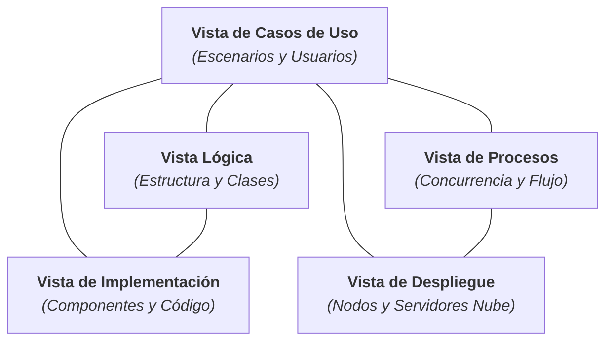

- **Vista de Casos de Uso:** Funciona como el elemento integrador central (+1), definiendo los escenarios críticos que validan la arquitectura (consulta de indicadores, alternancia de ámbito electoral, exportación CSV y búsqueda cívica).
- **Vista Lógica:** Describe las abstracciones del sistema, subsistemas, paquetes, jerarquías de clases y estructuras de datos no relacionales en formato JSON.
- **Vista de Procesos:** Analiza la concurrencia, sincronización de eventos del DOM y el procesamiento asíncrono de peticiones en el navegador del cliente.
- **Vista de Implementación:** Modela la organización estática de los artefactos de código fuente, scripts de construcción Node.js y componentes empaquetados en `dist/`.
- **Vista de Despliegue:** Detalla la topología física y en la nube (cliente web, red perimetral CDN de Render, repositorios GitHub y protocolos TLS/HTTPS).

<span id="_sec1_2"></span>
### 1.2. Alcance

El alcance arquitectónico abarca el diseño global de la solución de software orientada a la web, bajo el paradigma **JAMstack** (JavaScript nativo, APIs/JSON desacoplados y Markup estático precompilado). Cubre los subsistemas analíticos (cálculo de cuotas electorales, brechas porcentuales, gráficos interactivos CSS/SVG) y los subsistemas cívicos (motor de búsqueda diacrítica, directorio telefónico y guía imprimible de dispensas). Se prioriza la máxima eficiencia y portabilidad, omitiendo la necesidad de un motor de bases de datos relacional dinámico en servidor y eliminando dependencias pesadas de frameworks externos en runtime.

<span id="_sec1_3"></span>
### 1.3. Definición, siglas y abreviaturas

* **API (Application Programming Interface):** Interfaz que define las interacciones entre múltiples componentes de software.
* **BCE (Boundary-Control-Entity):** Patrón de análisis arquitectónico que divide los objetos en interfaces de usuario, controladores de lógica y entidades de datos.
* **CDN (Content Delivery Network):** Red distribuida geográficamente de servidores perimetrales que entregan contenido estático con mínima latencia.
* **CSS Grid / Flexbox:** Módulos de maquetación nativa de CSS3 empleados para lograr un diseño totalmente adaptable (*responsive*).
* **CSV (Comma-Separated Values):** Formato tabular para intercambio y exportación de datos numéricos con codificación UTF-8 y marca BOM.
* **DOM (Document Object Model):** Estructura jerárquica en árbol de los elementos HTML manipulados dinámicamente por JavaScript.
* **ERM 2026:** Elecciones Regionales y Municipales 2026 en el Perú.
* **JAMstack:** Arquitectura web moderna basada en JavaScript del cliente, APIs y Markup estático.
* **JNE:** Jurado Nacional de Elecciones.
* **KPI (Key Performance Indicator):** Indicador clave de rendimiento o desempeño.
* **ONPE:** Oficina Nacional de Procesos Electorales.
* **QA (Quality Attribute):** Atributo de calidad del software (rendimiento, seguridad, usabilidad, etc.).
* **RENIEC:** Registro Nacional de Identificación y Estado Civil.
* **SPA (Single Page Application):** Aplicación web de una sola página que actualiza dinámicamente el contenido mediante rutas hash sin recargar la ventana.
* **WAI-ARIA:** Estándar de accesibilidad web para usuarios con discapacidades técnicas o visuales.

<span id="_sec1_4"></span>
### 1.4. Organización del documento

El documento se estructura en 4 secciones capitales: la Sección 1 introduce el modelo 4+1, el alcance y glosario; la Sección 2 establece los objetivos arquitectónicos, matrices de priorización de requerimientos y restricciones tecnológicas; la Sección 3 presenta de forma exhaustiva las 5 vistas arquitectónicas mediante diagramas UML y Mermaid; y la Sección 4 formaliza los escenarios de atributos de calidad del software (QAs), culminando con conclusiones, recomendaciones y bibliografía especializada.

<div style="page-break-after: always; visibility: hidden">\pagebreak</div>

<span id="_sec2"></span>
# **2. OBJETIVOS Y RESTRICCIONES ARQUITECTONICAS**

<span id="_sec2_1"></span>
### 2.1. Priorización de requerimientos

La arquitectura del sistema ha sido diseñada teniendo como directriz primaria la priorización de aquellos requerimientos que impactan directamente en la velocidad de respuesta, auditabilidad de los datos y facilidad de interacción ciudadana:

<span id="_sec2_1_1"></span>
#### 2.1.1. Requerimientos Funcionales

| ID | Descripcion | Prioridad |
| :---: | :--- | :---: |
| **RF-01** | Visualización reactiva de indicadores para la Alcaldía Provincial de Tacna. | Alta |
| **RF-02** | Visualización reactiva de indicadores para la Gobernación Regional de Tacna. | Alta |
| **RF-03** | Cálculo matemático automático de la brecha porcentual entre el primer y segundo lugar. | Alta |
| **RF-04** | Renderizado de gráfico de barras proporcionales con cuotas de votación reportadas. | Alta |
| **RF-05** | Renderizado de gráfico donut de avance del escrutinio con corte horario. | Alta |
| **RF-06** | Selector segmentado para conmutar fluidamente entre elecciones sin recarga de página. | Alta |
| **RF-07** | Tabla de resultados con ranking de partidos y exportación dinámica a archivo CSV. | Media |
| **RF-08** | Buscador de servicios con normalización diacrítica (insensible a acentos y mayúsculas). | Alta |
| **RF-09** | Filtro temático de servicios al vecino (Trámites, Información y Atención municipal). | Media |
| **RF-10** | Directorio interactivo de las cuatro municipalidades provinciales con enlaces telefónicos directos. | Alta |
| **RF-11** | Lista de chequeo reactiva de 4 pasos para preparación de dispensa electoral. | Media |
| **RF-12** | Impresión formateada de la guía de dispensa mediante estilos CSS especializados. | Media |
| **RF-13** | Conmutador accesible de aumento tipográfico (`A+ Lectura`). | Baja |
| **RF-14** | Módulo de contexto territorial (4 provincias y 28 distritos) y advertencia de calidad RENIEC. | Media |
| **RF-15** | Sección de fuentes y metodología con hipervínculos a los reportes originales. | Media |

<span id="_sec2_1_2"></span>
#### 2.1.2. Requerimientos No Funcionales – Atributos de Calidad

| ID | Descripcion | Prioridad |
| :---: | :--- | :---: |
| **RNF-01** | **Rendimiento (Performance):** Carga interactiva (TTI) menor a 1.0 segundo y First Contentful Paint < 0.5s. | Alta |
| **RNF-02** | **Disponibilidad:** Uptime del 99.9% mediante distribución en la red global CDN de Render. | Alta |
| **RNF-03** | **Seguridad y Cifrado:** Transferencia obligatoria sobre protocolo HTTPS con cifrado TLS 1.3. | Alta |
| **RNF-04** | **Privacidad:** Cero almacenamiento o procesamiento de números de DNI en los servidores de la app. | Alta |
| **RNF-05** | **Usabilidad Móvil:** Interfaz adaptativa líquida compatible desde pantallas de 320px hasta 4K. | Alta |
| **RNF-06** | **Accesibilidad (WAI-ARIA):** Cumplimiento de directrices WCAG 2.1 nivel AA y contraste superior a 4.5:1. | Media |
| **RNF-07** | **Mantenibilidad:** Arquitectura desacoplada basada en archivos JSON fácilmente editables sin recompilar JS. | Alta |
| **RNF-08** | **Interoperabilidad:** Exportación CSV con BOM UTF-8 para compatibilidad transparente en Excel. | Media |
| **RNF-09** | **Cero Runtime Dependencies:** Ejecución pura en el cliente sin frameworks pesados ni librerías externas. | Alta |
| **RNF-10** | **Optimización de Estilos de Impresión:** Supresión de menús y barras laterales al emitir `window.print()`. | Baja |

<span id="_sec2_2"></span>
### 2.2. Restricciones

1. **Restricción de Infraestructura (Sitio Estático en Servidor):** No se permite la ejecución de servidores de aplicaciones de backend en tiempo real (como Django, Spring Boot o Express) ni la conexión a motores de bases de datos relacionales tradicionales en producción. La entrega debe ser 100% estática vía Render Static Sites.
2. **Restricción de Conectividad y Fuentes en Tiempo Real:** El sistema no implementa WebSockets ni sondeos (*polling*) masivos contra los servidores de la ONPE para evitar saturación de las infraestructuras electorales oficiales; opera sobre copias fechadas auditables.
3. **Restricción de Privacidad y Normativa:** Cumplimiento estricto de la Ley N° 29733 de Protección de Datos Personales: ninguna funcionalidad debe solicitar, almacenar o persistir el DNI o nombres de los votantes.
4. **Restricción de Compatibilidad:** Uso de ECMAScript 6 nativo sin polyfills para navegadores obsoletos sin soporte para CSS Variables o Grid (exclusión de IE11).

<div style="page-break-after: always; visibility: hidden">\pagebreak</div>

<span id="_sec3"></span>
# **3. REPRESENTACIÓN DE LA ARQUITECTURA DEL SISTEMA**

<span id="_sec3_1"></span>
### 3.1. Vista de Caso de uso

La Vista de Casos de Uso sirve de directriz arquitectónica central, articulando la interacción entre los actores del sistema y los servicios entregados por los subsistemas analíticos y cívicos:

<span id="_sec3_1_1"></span>
#### 3.1.1. Diagramas de Casos de uso

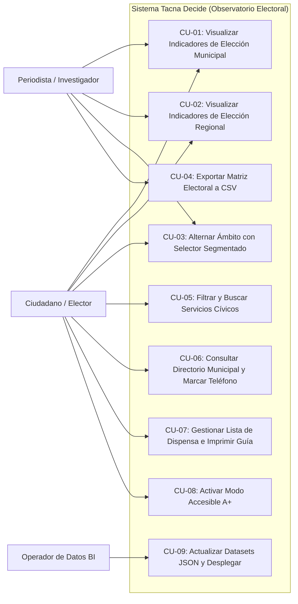

- **Realización del CU-04 (Exportación CSV):** El actor pulsa "Descargar CSV", el controlador `ExportController` formatea la matriz con el BOM `\uFEFF` y genera un objeto `Blob` en memoria del cliente, iniciando la descarga sin peticiones al servidor.
- **Realización del CU-05 (Búsqueda Cívica):** El usuario escribe un texto en el buscador; el motor de búsqueda en el cliente normaliza la cadena removiendo acentos y filtra el array `citizen.services` en tiempo real (< 15 ms).

<div style="page-break-after: always; visibility: hidden">\pagebreak</div>

<span id="_sec3_2"></span>
### 3.2. Vista Lógica

La Vista Lógica representa la organización estructural de los conceptos y clases arquitectónicamente significativas:

<span id="_sec3_2_1"></span>
#### 3.2.1. Diagrama de Subsistemas (paquetes)

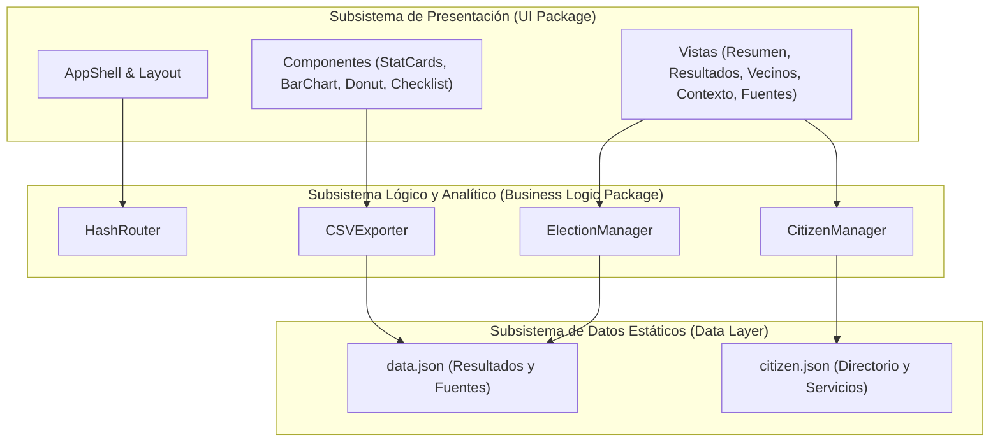

<span id="_sec3_2_2"></span>
#### 3.2.2. Diagrama de Secuencia (vista de diseño)

Flujo de interacción ante el cambio de elección (de Municipal a Regional):

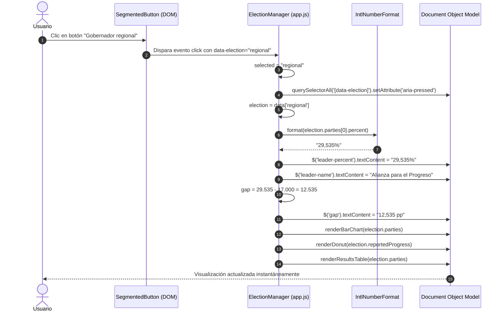

<div style="page-break-after: always; visibility: hidden">\pagebreak</div>

<span id="_sec3_2_3"></span>
#### 3.2.3. Diagrama de Colaboración (vista de diseño)

El diagrama de colaboración ilustra los enlaces y el intercambio de mensajes entre objetos concurrentes durante la búsqueda de servicios:

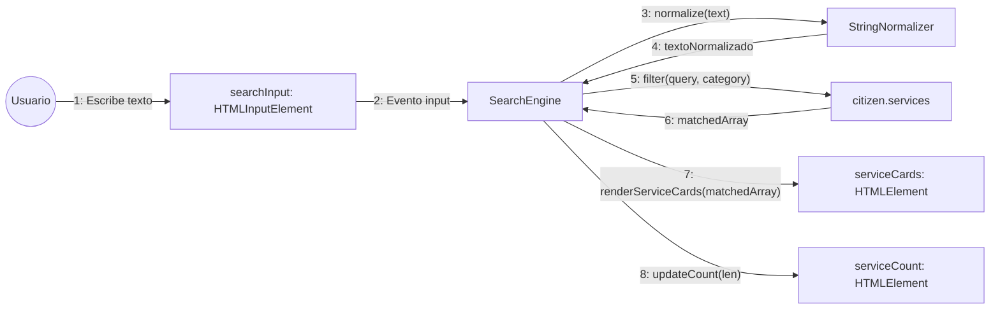

<span id="_sec3_2_4"></span>
#### 3.2.4. Diagrama de Objetos

Instancias reales en memoria durante la ejecución de la aplicación:

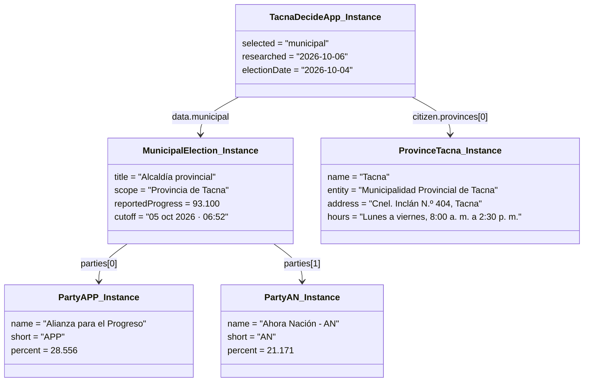

<div style="page-break-after: always; visibility: hidden">\pagebreak</div>

<span id="_sec3_2_5"></span>
#### 3.2.5. Diagrama de Clases

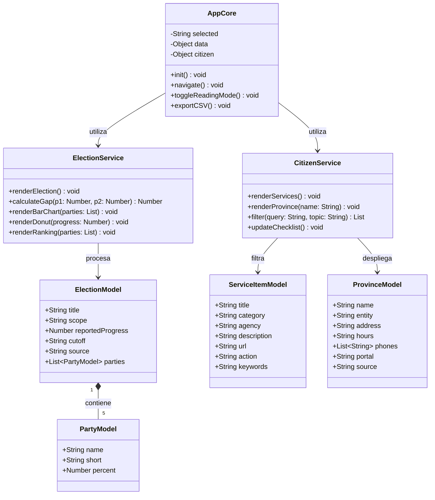

<span id="_sec3_2_6"></span>
#### 3.2.6. Diagrama de Base de datos (relacional o no relacional)

El modelo de persistencia es **No Relacional (Documental Estático JSON)**. La estructura de colecciones y esquemas de los documentos JSON se detalla a continuación:

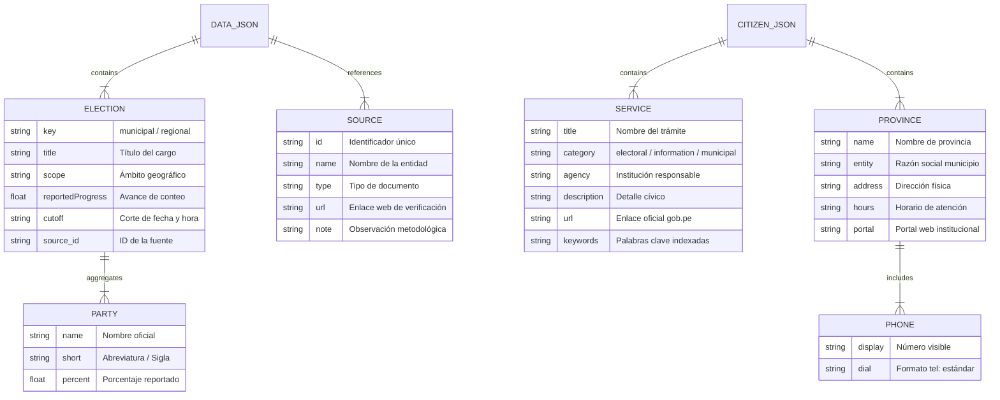

<div style="page-break-after: always; visibility: hidden">\pagebreak</div>

<span id="_sec3_3"></span>
### 3.3. Vista de Implementación (vista de desarrollo)

<span id="_sec3_3_1"></span>
#### 3.3.1. Diagrama de arquitectura software (paquetes)

Organización física del árbol de código fuente y artefactos empaquetados:

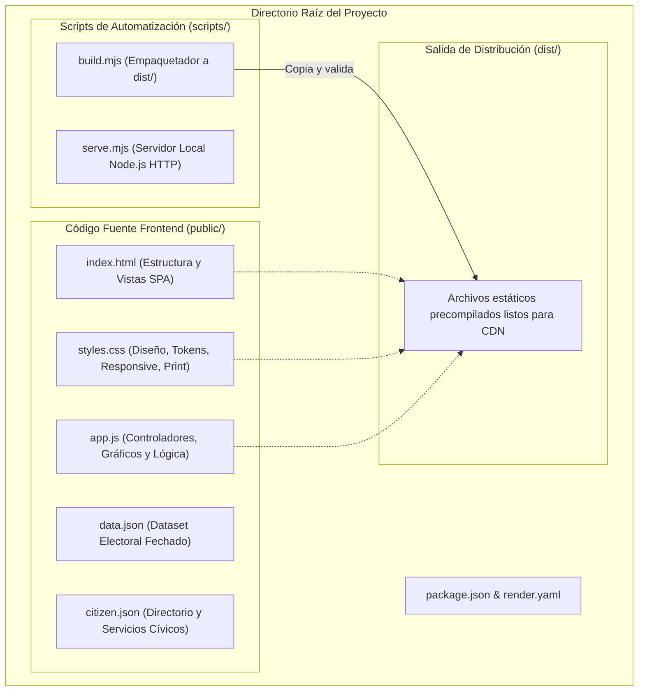

<span id="_sec3_3_2"></span>
#### 3.3.2. Diagrama de arquitectura del sistema (Diagrama de componentes)

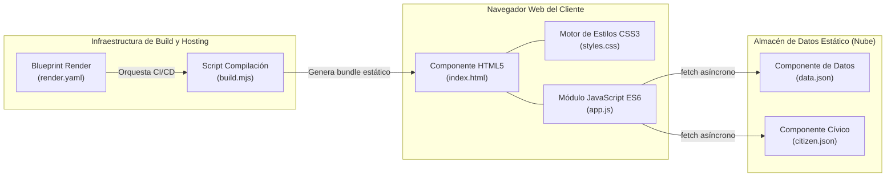

<div style="page-break-after: always; visibility: hidden">\pagebreak</div>

<span id="_sec3_4"></span>
### 3.4. Vista de procesos

<span id="_sec3_4_1"></span>
#### 3.4.1. Diagrama de Procesos del sistema (diagrama de actividad)

Describe la concurrencia, asincronía y el ciclo de vida de los procesos en tiempo de ejecución:

```mermaid
flowchart TD
    subgraph P_Main["Proceso de Hilo Principal (UI Thread - Navegador)"]
        start([Inicio]) --> loadDoc[Descarga y parseo inicial de index.html]
        loadDoc --> renderSkeleton[Renderiza App Shell y estado #loading]
        renderSkeleton --> spawnFetch[Dispara peticiones asíncronas fetch()]
    end
    
    subgraph P_Async["Procesos Asíncronos en Segundo Plano (I/O)"]
        spawnFetch --> fetchD[fetch('data.json')]
        spawnFetch --> fetchC[fetch('citizen.json')]
        fetchD --> parseD[Parseo JSON data]
        fetchC --> parseC[Parseo JSON citizen]
    end
    
    parseD --> joinEvents[Resolución de Promesas]
    parseC --> joinEvents
    
    subgraph P_Render["Proceso de Actualización Reactiva del DOM"]
        joinEvents --> execCalc[Calcula brecha, porcentajes y fuentes]
        execCalc --> buildDOM[Inyecta barras, donut, tarjetas y directorio]
        buildDOM --> hideLoading[Oculta #loading y muestra #dashboard]
        hideLoading --> listenEvents[Queda en escucha de eventos: click, input, hashchange]
    end
    
    listenEvents --> userAction{Interacción del Usuario}
    userAction -- Clic hash (#vecinos) --> routeNav[navigate(): conmuta vistas]
    userAction -- Input en buscador --> filterTask[renderServices(): filtra en <15ms]
    userAction -- Clic CSV --> exportTask[exportCSV(): genera y descarga Blob]
    routeNav --> listenEvents
    filterTask --> listenEvents
    exportTask --> listenEvents
```

<div style="page-break-after: always; visibility: hidden">\pagebreak</div>

<span id="_sec3_5"></span>
### 3.5. Vista de Despliegue (vista física)

<span id="_sec3_5_1"></span>
#### 3.5.1. Diagrama de despliegue

La arquitectura física distribuye la carga mediante una infraestructura perimetral en la nube (CDN) de alta resiliencia:

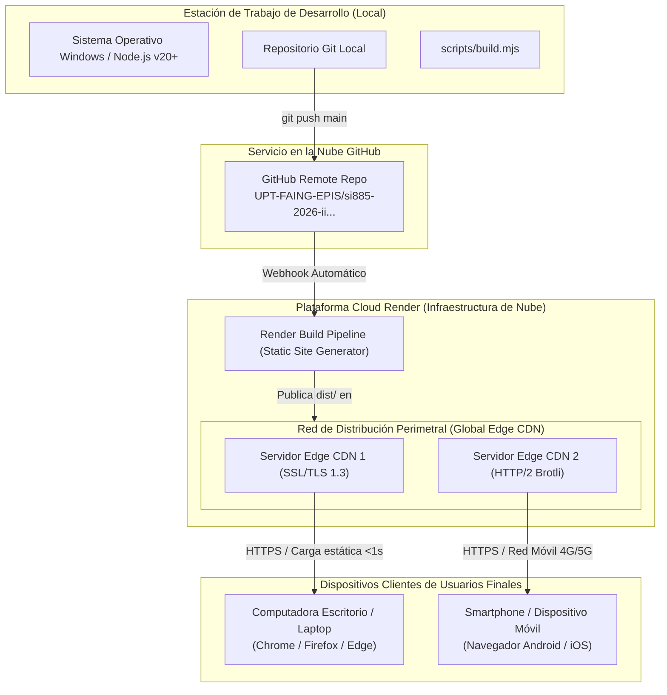

- **Topología de red:** Comunicación cliente-servidor asegurada mediante túneles HTTPS con certificados TLS emitidos por Let's Encrypt de renovación automática.
- **Tolerancia a fallos:** El contenido se cachea en servidores Edge a nivel global; si un nodo perimetral sufre congestión, el balanceador redirige el tráfico al nodo más cercano sin interrupción del servicio.

<div style="page-break-after: always; visibility: hidden">\pagebreak</div>

<span id="_sec4"></span>
# **4. ATRIBUTOS DE CALIDAD DEL SOFTWARE**

<span id="_sec4_1"></span>
### Escenario de Funcionalidad

* **Fuente del estímulo:** Ciudadano o periodista consultando la plataforma.
* **Estímulo:** El usuario pulsa sobre el botón "Gobernador regional" para revisar los resultados de la elección departamental.
* **Artefacto afectado:** Componente `ElectionManager` y elementos visuales del DOM (`bar-chart`, `donut`, `leader-percent`, `gap`).
* **Entorno:** Operación normal en cliente web móvil o de escritorio.
* **Respuesta:** La lógica de negocio recalcula la brecha entre Alianza para el Progreso (29.535%) y Ahora Nación (17.000%) obteniendo 12.535 pp, y redibuja las barras y el donut en menos de 50 milisegundos sin solicitar nuevos recursos al servidor.
* **Medida de la respuesta:** Cero recargas de página y concordancia del 100% con los datos auditados en `data.json`.

<span id="_sec4_2"></span>
### Escenario de Usabilidad

* **Fuente del estímulo:** Vecino con baja visión o adulto mayor que ingresa desde un teléfono móvil.
* **Estímulo:** El usuario presiona el conmutador "A+ Lectura" en la barra superior.
* **Artefacto afectado:** Hoja de estilos `styles.css` y etiqueta raíz `document.body`.
* **Entorno:** Dispositivo móvil con pantalla pequeña (resolución 360x640px).
* **Respuesta:** Se añade la clase `large-reading`, escalando de forma armónica los tamaños tipográficos (`font-size`) e interlineados (`line-height`) en un 15% adicional sin desbordamientos horizontales ni colisiones de cajas.
* **Medida de la respuesta:** Tiempo de ajuste visual inmediato (< 10 ms) y cambio de estado accesible `aria-pressed="true"`.

<span id="_sec4_3"></span>
### Escenario de confiabilidad

* **Fuente del estímulo:** Saturación externa o intento de acceso con red inestable.
* **Estímulo:** Falla momentánea en la descarga de `citizen.json` al cargar la vista de servicios.
* **Artefacto afectado:** Manejador de promesas `fetch().catch()` en `app.js`.
* **Entorno:** Conexión intermitente de datos celulares móviles en zonas rurales de Tarata o Candarave.
* **Respuesta:** El sistema captura el error de forma segura en el bloque `catch`, evitando que la aplicación se congele o muestre pantallas blancas de error. En su lugar, despliega un aviso claro: *"No se pudo cargar el directorio. Recarga la página para volver a intentarlo"*.
* **Medida de la respuesta:** Cero errores no controlados en la consola del navegador y estabilidad del resto de la interfaz.

<span id="_sec4_4"></span>
### Escenario de rendimiento

* **Fuente del estímulo:** Avalancha de tráfico concurrente tras la publicación de nuevos reportes de conteo de votos (picos de 5,000 peticiones por minuto).
* **Estímulo:** Petición HTTP GET sobre los archivos de la plataforma.
* **Artefacto afectado:** Servidores Edge CDN de Render Static Sites.
* **Entorno:** Noche de jornada electoral con alta concurrencia ciudadana.
* **Respuesta:** Al ser un sitio estático precompilado con compresión Brotli y almacenamiento en memoria perimetral, la CDN despacha los archivos sin ejecutar consultas a base de datos ni invocar intérpretes de servidor.
* **Medida de la respuesta:** Tiempo de respuesta inferior a 200 ms por solicitud y tasa de caída del 0.00%.

<span id="_sec4_5"></span>
### Escenario de mantenibilidad

* **Fuente del estímulo:** Operador del sistema o analista de Inteligencia de Negocios.
* **Estímulo:** Necesidad de incorporar un nuevo corte de conteo de la ONPE emitido a las 18:00 horas.
* **Artefacto afectado:** Archivo de datos `public/data.json`.
* **Entorno:** Entorno de mantenimiento mediante editor de texto y control de versiones Git.
* **Respuesta:** El operador modifica únicamente los valores numéricos, fecha de corte y enlace en `data.json`, ejecuta `npm run build` y realiza `git push`. La infraestructura de Render detecta el commit y redespliega el sitio actualizado en producción automáticamente en menos de 60 segundos.
* **Medida de la respuesta:** Cero modificaciones a la lógica de presentación JavaScript o a la estructura HTML.

<span id="_sec4_6"></span>
### Otros Escenarios

* **Escenario de Seguridad y Privacidad (Data Protection):**
  * *Condición:* Un usuario malicioso intenta inyectar scripts maliciosos (XSS) a través del campo de búsqueda de servicios cívicos.
  * *Respuesta:* El motor de búsqueda no utiliza `eval()` ni asignaciones inseguras como `innerHTML` sobre entradas no desinfectadas; procesa el texto mediante `normalize()` y compara con propiedades de objetos nativos, neutralizando cualquier riesgo de inyección.
* **Escenario de Portabilidad e Impresión (Print Media):**
  * *Condición:* Un ciudadano sin conectividad permanente pulsa el botón "Imprimir guía" en la sección de dispensa electoral.
  * *Respuesta:* La regla `@media print` de `styles.css` oculta menús laterales, barras de navegación, botones y colores de fondo oscuros, transformando la tarjeta en una guía limpia con tipografía negra sobre fondo blanco, lista para imprimirse en una sola hoja A4 con su respectiva URL fuente de verificación.

<div style="page-break-after: always; visibility: hidden">\pagebreak</div>

<span id="_conclusiones"></span>
# **CONCLUSIONES**

1. **Idoneidad de la Arquitectura JAMstack:** La selección de una arquitectura web estática desacoplada (HTML5, CSS3, ES6 y JSON) sobre Render Static Sites resuelve de forma sobresaliente el reto de disponibilidad y rendimiento, eliminando la vulnerabilidad y sobrecarga inherente a los servidores tradicionales de bases de datos.
2. **Claridad del Modelo 4+1:** El desglose a través de las cinco vistas arquitectónicas de Kruchten demuestra la coherencia global del sistema, desde los casos de uso cívicos hasta los componentes físicos desplegados sobre servidores Edge CDN con HTTPS forzado.
3. **Eficiencia en Mantenibilidad y Evolución:** La separación estricta entre la capa de datos (`data.json` y `citizen.json`) y la capa de presentación permite actualizar cifras electorales en cuestión de minutos sin riesgo de introducir defectos en la lógica del cliente.
4. **Respaldo a los Atributos de Calidad:** Los escenarios formalizados de funcionalidad, usabilidad, confiabilidad, rendimiento y mantenibilidad garantizan que *Tacna Decide* opere con un estándar de excelencia tecnológica digno de un observatorio regional universitario.

<div style="page-break-after: always; visibility: hidden">\pagebreak</div>

<span id="_recomendaciones"></span>
# **RECOMENDACIONES**

1. **Monitoreo de Métricas Web Vitals:** Implementar mediciones automatizadas de Core Web Vitals (LCP, FID/INP, CLS) en producción para auditar que el rendimiento interactivo se mantenga por debajo de los 100 ms ante futuras ampliaciones.
2. **Evolución hacia Progressive Web App (PWA):** En la siguiente fase de desarrollo, incorporar un archivo `manifest.json` y un Service Worker que permita cachear los datasets electorales para consulta offline en zonas sin cobertura de red.
3. **Validación Automática en CI/CD:** Añadir un paso de validación JSON Schema dentro del pipeline de build de Render para garantizar que ningún commit con errores de sintaxis en `data.json` interrumpa la entrega continua.

<div style="page-break-after: always; visibility: hidden">\pagebreak</div>

<span id="_bibliografia"></span>
# **BIBLIOGRAFIA**

1. Kruchten, P. (1995). *Architectural Blueprints—The "4+1" View Model of Software Architecture*. IEEE Software, 12(6), 42-50.
2. Bass, L., Clements, P., & Kazman, R. (2012). *Software Architecture in Practice* (3rd ed.). Addison-Wesley.
3. Pressman, R. S., & Maxim, B. R. (2020). *Software Engineering: A Practitioner's Approach* (9th ed.). McGraw-Hill Education.
4. Wojcik, R., et al. (2013). *Attribute-Driven Design (ADD), Version 2.0*. Software Engineering Institute, Carnegie Mellon University.
5. Few, S. (2013). *Information Dashboard Design: Displaying Data for At-a-Glance Monitoring* (2nd ed.). Analytics Press.
6. Richards, M., & Ford, N. (2020). *Fundamentals of Software Architecture: An Engineering Approach*. O'Reilly Media.

<div style="page-break-after: always; visibility: hidden">\pagebreak</div>

<span id="_webgrafia"></span>
# **WEBGRAFIA**

1. The JAMstack Architecture Reference: https://jamstack.org/
2. Render Cloud Platform - Static Sites Architecture: https://render.com/docs/static-sites
3. Mozilla Developer Network (MDN) - Web APIs & Performance: https://developer.mozilla.org/es/docs/Web/API
4. W3C - Web Content Accessibility Guidelines (WCAG) 2.1: https://www.w3.org/TR/WCAG21/
5. Jurado Nacional de Elecciones (JNE) - Plataforma Oficial: https://www.jne.gob.pe/
6. Oficina Nacional de Procesos Electorales (ONPE) - Proceso ERM 2026: https://erm2026.onpe.gob.pe/
7. Repositorio Oficial en GitHub: https://github.com/UPT-FAING-EPIS/si885-2026-ii-si885-2026-ii-proyecto-group-1
