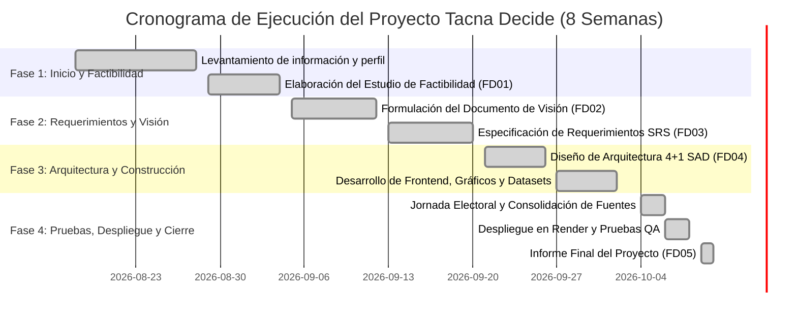

<center>

[comment]: 


**UNIVERSIDAD PRIVADA DE TACNA**

**FACULTAD DE INGENIERIA**

**Escuela Profesional de Ingeniería de Sistemas**

<br>

## **Informe Final**

### **Proyecto *Tacna Decide — Dashboard Electoral y Observatorio de Inteligencia Cívica***

<br>

**Curso:** *Inteligencia de Negocios (SI-885)*

**Docente:** *Mag. Patrick José Cuadros Quiroga*

**Integrantes:**

***Andia Navarro, Diego Fabrizio (2022073906)***  
***Vargas Candia, Hashira Belén (2022075480)***  
***Platero Maron, Victor Joseph (2022075478)***  
***(Grupo 1)***

<br>

**Tacna – Perú**

***2026***

**  
**
</center>
<div style="page-break-after: always; visibility: hidden">\pagebreak</div>

|CONTROL DE VERSIONES||||||
| :-: | :- | :- | :- | :- | :- |
|Versión|Hecha por|Revisada por|Aprobada por|Fecha|Motivo|
|1\.0|DFAN / HBVC / VJPM|HBVC|VJPM|06/10/2026|Versión Original y Culminación del Proyecto|


**Sistema *Tacna Decide — Dashboard Electoral***

**Informe Final del Proyecto**

**Versión *1.0***

<div style="page-break-after: always; visibility: hidden">\pagebreak</div>

|CONTROL DE VERSIONES||||||
| :-: | :- | :- | :- | :- | :- |
|Versión|Hecha por|Revisada por|Aprobada por|Fecha|Motivo|
|1\.0|DFAN / HBVC / VJPM|HBVC|VJPM|06/10/2026|Versión Original y Culminación del Proyecto|


<div style="page-break-after: always; visibility: hidden">\pagebreak</div>

# **INDICE GENERAL**

- [1. Antecedentes](#_sec1)
- [2. Planteamiento del Problema](#_sec2)
  - [a. Problema](#_sec2_a)
  - [b. Justificación](#_sec2_b)
  - [c. Alcance](#_sec2_c)
- [3. Objetivos](#_sec3)
- [4. Marco Teórico](#_sec4)
- [5. Desarrollo de la Solución](#_sec5)
  - [a. Análisis de Factibilidad (técnico, económica, operativa, social, legal, ambiental)](#_sec5_a)
  - [b. Tecnología de Desarrollo](#_sec5_b)
  - [c. Metodología de implementación (Documento de VISION, SRS, SAD)](#_sec5_c)
- [6. Cronograma](#_sec6)
- [7. Presupuesto](#_sec7)
- [8. Conclusiones](#_sec8)
- [Recomendaciones](#_recomendaciones)
- [Bibliografía](#_bibliografia)
- [Anexos](#_anexos)
  - [Anexo 01 Informe de Factibilidad](#_anexo1)
  - [Anexo 02 Documento de Visión](#_anexo2)
  - [Anexo 03 Documento SRS](#_anexo3)
  - [Anexo 04 Documento SAD](#_anexo4)
  - [Anexo 05 Manuales y otros documentos](#_anexo5)

<div style="page-break-after: always; visibility: hidden">\pagebreak</div>

<span id="_sec1"></span>
# **1. Antecedentes**

En los últimos procesos electorales subnacionales desarrollados en el Perú, y particularmente en el departamento de Tacna, la difusión de resultados del escrutinio por parte de los organismos de la administración electoral (ONPE y JNE) y los medios periodísticos ha enfrentado complejos desafíos técnicos y comunicacionales. Históricamente, la ciudadanía y los medios locales recurren a múltiples canales no coordinados durante la noche electoral y los días posteriores a los comicios, enfrentándose a portales oficiales que presentan sobrecarga y caídas intermitentes ante picos masivos de peticiones concurrentes, así como a la proliferación de noticias no confirmadas o sondeos a boca de urna que generan percepciones prematuras sobre supuestos ganadores.

A nivel de la Escuela Profesional de Ingeniería de Sistemas (EPIS) de la Universidad Privada de Tacna, la asignatura de **Inteligencia de Negocios (SI-885)** promueve la formulación de soluciones orientadas a la captura, estructuración, análisis y despliegue visual de datos estratégicos para respaldar la toma de decisiones basada en evidencia. Como antecedente técnico directo del presente proyecto, se identificó la inexistencia en la región de Tacna de un observatorio digital de acceso público, ligero y neutral que combine la analítica visual de resultados electorales con herramientas prácticas de servicio comunitario (tales como la verificación de multas electorales, requisitos de dispensa y directorios de atención de gobiernos locales provinciales).

Con base en este diagnóstico, el equipo de desarrollo estructuró el proyecto **Tacna Decide**, concebido para las Elecciones Regionales y Municipales 2026 (ERM 2026) celebradas el 4 de octubre de 2026, estableciendo una plataforma de alta disponibilidad y trazabilidad basada en fuentes periodísticas e institucionales auditadas fechadas al 6 de octubre de 2026.

<div style="page-break-after: always; visibility: hidden">\pagebreak</div>

<span id="_sec2"></span>
# **2. Planteamiento del Problema**

<span id="_sec2_a"></span>
### a. Problema

El problema central identificado radica en la **dispersión, falta de contexto metodológico y alta saturación de los canales informativos sobre los resultados electorales de la provincia y región de Tacna**, situación que se agrava por el desconocimiento generalizado de los electores acerca de los procedimientos y trámites cívicos post-electorales inmediatos. 

Específicamente, se identificaron tres manifestaciones críticas del problema:
1. **Descontextualización estadística:** Los reportes de prensa y redes sociales difunden porcentajes preliminares sin explicitar el porcentaje de avance del conteo de actas, la brecha matemática con el contendor inmediato ni la definición de los denominadores (votos válidos vs. votos emitidos), induciendo a la población a confundir cómputos parciales con victorias electorales definitivas.
2. **Fragilidad de la infraestructura tradicional:** Los portales de los entes electorales centrales sufren saturación recurrente ante la alta afluencia ciudadana, careciendo de soluciones ligeras optimizadas para dispositivos móviles de baja gama o zonas con conectividad reducida en provincias altas (Tarata, Candarave y Jorge Basadre).
3. **Desconexión con las necesidades cívicas del elector:** Tras la jornada de sufragio, miles de vecinos enfrentan dudas sobre cómo gestionar dispensas o justificaciones por omisión al voto ante el JNE, dónde verificar multas pendientes y cómo comunicarse directamente con sus municipalidades provinciales, derivando en traslados físicos innecesarios y pérdida de tiempo.

<span id="_sec2_b"></span>
### b. Justificación

El desarrollo del proyecto *Tacna Decide* se justifica plenamente desde múltiples dimensiones:
* **Justificación Social y Democrática:** Fortalece la cultura democrática y la transparencia electoral en la región, mitigando la polarización y la desinformación al proveer una plataforma abierta, imparcial y auditada que advierte expresamente el carácter parcial de las cifras y los estados oficiales de proclamación.
* **Justificación Tecnológica e Innovadora:** Demuestra la superioridad y costo-eficiencia de la arquitectura **JAMstack** (sitio estático en la nube sin base de datos en runtime) para escenarios de alta concurrencia masiva, alcanzando tiempos de respuesta inferiores a un segundo, disponibilidad del 99.9% y costo cero de servidor.
* **Justificación Práctica Ciudadana:** Integra en una sola ventana el monitoreo electoral analítico y la atención cívica, proveyendo un directorio municipal con enlaces telefónicos directos (`tel:`), una lista de chequeo para dispensas electorales con soporte de impresión y un modo accesible de lectura ampliada (`A+`).
* **Justificación Académica:** Representa la aplicación empírica e integral de los conocimientos de modelado orientado a objetos, especificación de requerimientos (IEEE 830 / RUP), arquitectura de software (Modelo 4+1 de Kruchten) e Inteligencia de Negocios en la Universidad Privada de Tacna.

<span id="_sec2_c"></span>
### c. Alcance

El sistema *Tacna Decide* abarca:
- **Ámbito Geopolítico:** Cobertura de la elección a la **Alcaldía Provincial de Tacna** (ámbito provincial) y la elección a la **Gobernación Regional de Tacna** (ámbito departamental que abarca las 4 provincias: Tacna, Tarata, Candarave y Jorge Basadre).
- **Métricas e Indicadores Clave (KPIs):** Visualización de la organización líder, brecha matemática con el segundo lugar, total de organizaciones computadas, avance del conteo de actas atribuido a ONPE, corte horario de cada reporte y enlace directo a la fuente original.
- **Visualización Analítica:** Gráficos interactivos de barras horizontales proporcionales (escala referencial al 40%), anillo donut de avance del escrutinio en CSS cónico y tabla detallada con exportación dinámica a archivo CSV con codificación UTF-8 con BOM.
- **Servicios al Ciudadano:** Motor de búsqueda con normalización diacrítica (remoción de tildes) y filtro por categorías (Trámites electorales, Información electoral y Atención municipal), directorio telefónico de las cuatro municipalidades provinciales, guía interactiva e imprimible de dispensa/justificación electoral y modo accesible de lectura ampliada.
- **Límites y Exclusiones:** El sistema no recolecta números de DNI ni datos personales, no procesa pagos bancarios de multas, no se conecta mediante WebSockets en vivo a la ONPE y no emite proclamaciones definitivas de ganadores.

<div style="page-break-after: always; visibility: hidden">\pagebreak</div>

<span id="_sec3"></span>
# **3. Objetivos**

### Objetivo General

Diseñar, construir e implementar un tablero analítico (Dashboard) web interactivo, estático y de alta disponibilidad para la visualización, monitoreo y contextualización de los resultados parciales de las Elecciones Regionales y Municipales 2026 en Tacna, integrando un catálogo unificado de orientación cívica y servicios municipales para la ciudadanía del departamento.

### Objetivos Específicos

1. **OE1:** Estructurar y depurar los conjuntos de datos en formato JSON desacoplado (`data.json` y `citizen.json`), registrando métricas de votación, cortes horarios auditables, metadatos de fuentes oficiales y canales de contacto municipal de las cuatro provincias de Tacna.
2. **OE2:** Desarrollar la interfaz web interactiva bajo estándares semánticos de HTML5, maquetación adaptativa CSS3 (Flexbox/Grid) y lógica reactiva en JavaScript Vanilla (ES6+), permitiendo la alternancia fluida entre los cargos provincial y regional sin recargar la página.
3. **OE3:** Implementar los componentes analíticos de Inteligencia de Negocios: cálculo automático de brechas porcentuales, gráficos proporcionales de barras, donuts de avance del conteo y tabla de posiciones con exportación a archivos CSV.
4. **OE4:** Diseñar e integrar el módulo "Servicios para vecinos", incorporando un motor de búsqueda diacrítica, directorio telefónico provincial con marcado directo (`tel:`) y una guía de preparación de dispensa electoral con soporte de impresión en formato A4.
5. **OE5:** Configurar el pipeline de compilación automatizado con scripts nativos en Node.js v20+ y desplegar el sistema en la infraestructura global de Render Static Sites con certificación de seguridad SSL/TLS y tiempos de carga inferiores a 1 segundo.

<div style="page-break-after: always; visibility: hidden">\pagebreak</div>

<span id="_sec4"></span>
# **4. Marco Teórico**

### 4.1. Inteligencia de Negocios (Business Intelligence - BI)
La Inteligencia de Negocios comprende un conjunto integrado de metodologías, arquitecturas y tecnologías que permiten recopilar, integrar, depurar y transformar datos brutos en información estructurada para la toma de decisiones informadas (Kimball & Ross, 2013). En el ámbito público y cívico, la Inteligencia de Negocios evoluciona hacia el paradigma de la **Gobernanza de Datos Abiertos**, donde los tableros de control ofrecen métricas clave a la ciudadanía para fiscalizar los procesos democráticos en tiempo real.

### 4.2. Diseño de Cuadros de Mando (Dashboards)
Según Stephen Few (2013), un cuadro de mando es una visualización gráfica de la información más crítica necesaria para alcanzar uno o más objetivos, consolidada y dispuesta en una sola pantalla para que la información pueda ser monitoreada de un solo vistazo. El diseño de *Tacna Decide* aplica los principios de Few sobre economía visual: eliminación de ruido gráfico innecesario, uso de códigos de color sobrios y contrastantes (azul marino corporativo `#0d304c` y acentos ámbar `#ffad32`), y disposición jerárquica de métricas donde los números clave (líder, brecha, avance) preceden a los gráficos de soporte.

### 4.3. Arquitectura JAMstack y Sitios Estáticos
La arquitectura **JAMstack** (JavaScript, APIs y Markup) representa una evolución fundamental en la ingeniería web. Al compilar previamente el marcado HTML y servir recursos estáticos a través de una red de distribución de contenido (CDN), se elimina la superficie de ataque típica de los servidores de bases de datos relacionales dinámicas (inyecciones SQL, congestión de memoria, denegación de servicio por consultas lentas). Esto garantiza que la plataforma escale elásticamente ante millones de peticiones simultáneas sin incurrir en costos de servidores dedicados (Richards & Ford, 2020).

### 4.4. Accesibilidad Web (WAI-ARIA y WCAG 2.1)
El consorcio W3C define las pautas de accesibilidad para el contenido web (WCAG 2.1) orientadas a asegurar que las aplicaciones sean perceptibles, operables, comprensibles y robustas. El estándar **WAI-ARIA** complementa el código HTML con atributos semánticos (`aria-pressed`, `aria-expanded`, `aria-label`, `role="status"`), permitiendo que lectores de pantalla y usuarios con limitaciones motrices o visuales interactúen plenamente con la información.

### 4.5. Marco Normativo Electoral y Protección de Datos en el Perú
- **Ley Orgánica de Elecciones (Ley N° 26859):** Regula el ejercicio del sufragio y establece que la proclamación oficial de ganadores es atribución privativa de los Jurados Electorales Especiales (JEE) y el JNE.
- **Ley de Transparencia y Acceso a la Información Pública (Ley N° 27806):** Consagra el derecho de toda persona a acceder a información generada por entidades del Estado.
- **Ley de Protección de Datos Personales (Ley N° 29733):** Exige el resguardo estricto de los datos personales. *Tacna Decide* cumple dicha ley al no recolectar DNI, nombres ni contraseñas.

<div style="page-break-after: always; visibility: hidden">\pagebreak</div>

<span id="_sec5"></span>
# **5. Desarrollo de la Solución**

<span id="_sec5_a"></span>
### a. Análisis de Factibilidad (técnico, económica, operativa, social, legal, ambiental)

El estudio de factibilidad (FD01) evaluó exhaustivamente la viabilidad integral del proyecto, concluyendo un dictamen plenamente favorable:
* **Factibilidad Técnica:** Plenamente factible al utilizar estándares web universales (HTML5, CSS3, ES6) y alojamiento estático sobre la red CDN perimetral de Render. No se requiere mantenimiento de servidores dedicados ni bases de datos dinámicas en tiempo de ejecución.
* **Factibilidad Económica y Financiera:** Inversión total valorizada en **S/. 7,180.00**. Los flujos proyectados a 12 meses arrojaron indicadores de alta rentabilidad:
  * **Relación Beneficio/Costo (B/C):** **1.56** ($> 1$).
  * **Valor Actual Neto (VAN):** **+S/. 5,305.00** (COK = 12.00% anual).
  * **Tasa Interna de Retorno (TIR):** **44.50%** anual.
* **Factibilidad Operativa:** El mantenimiento se realiza mediante la simple actualización de archivos JSON y despliegue automatizado vía Git, con curva de aprendizaje nula para el usuario final.
* **Factibilidad Social:** Promueve la cultura democrática, combate la desinformación en las cuatro provincias y ofrece accesibilidad visual a adultos mayores con el modo `A+`.
* **Factibilidad Legal:** Cumple con la Ley N° 27806 y Ley N° 29733; mantiene neutralidad y advierte el carácter provisional de los reportes.
* **Factibilidad Ambiental:** Huella de carbono digital mínima (< 150 KB por carga total de página) y digitalización de trámites que reduce el consumo de papel impreso.

<span id="_sec5_b"></span>
### b. Tecnología de Desarrollo

La solución fue desarrollada bajo un stack tecnológico moderno, robusto y eficiente:

```
┌────────────────────────────────────────────────────────┐
│                   Cliente Web (Browser)                │
│   HTML5 Semántico + CSS3 Responsive + Vanilla JS ES6   │
└───────────────────────────┬────────────────────────────┘
                            │ Fetch asíncrono
┌───────────────────────────▼────────────────────────────┐
│              Capa de Datos Estáticos (JSON)             │
│            public/data.json  &  public/citizen.json    │
└───────────────────────────┬────────────────────────────┘
                            │ Compilación con build.mjs
┌───────────────────────────▼────────────────────────────┐
│           Entorno de Construcción y Servidor           │
│     Node.js v20+ (scripts nativos ECMAScript .mjs)     │
└───────────────────────────┬────────────────────────────┘
                            │ Despliegue CI/CD
┌───────────────────────────▼────────────────────────────┐
│             Infraestructura Nube de Producción          │
│        Render Static Sites (Global Edge CDN / SSL)      │
└────────────────────────────────────────────────────────┘
```

- **Frontend:** HTML5 semántico con especificación WAI-ARIA; CSS3 nativo con Variables CSS, Flexbox y Grid; JavaScript Vanilla (ES6+) con manipulación reactiva del DOM.
- **Datos:** JSON desacoplado estructurado para trazabilidad de fuentes electorales y directorio municipal.
- **Herramientas de Build:** Node.js v20+ con `scripts/build.mjs` y `scripts/serve.mjs` (cero paquetes pesados en `node_modules` en producción).
- **Despliegue y Hosting:** Repositorio en GitHub integrado a Render mediante el archivo de infraestructura como código `render.yaml`.

<span id="_sec5_c"></span>
### c. Metodología de implementación (Documento de VISION, SRS, SAD)

El ciclo de desarrollo se guió por el marco RUP (Rational Unified Process) e IEEE, documentado formalmente en las fases de la EPIS:
1. **Documento de Visión (FD02):** Formalizó el posicionamiento del producto, los perfiles de interesados (ciudadanía, periodistas, academia, municipalidades), las necesidades prioritarias y el alcance funcional inicial.
2. **Documento de Especificación de Requerimientos de Software (FD03 / SRS):** Detalló los 15 Requerimientos Funcionales (RF-01 a RF-15), 10 Requerimientos No Funcionales (RNF-01 a RNF-10), 8 Reglas de Negocio, casos de uso con narrativas RUP completas y análisis de objetos bajo el patrón Boundary-Control-Entity (BCE).
3. **Documento de Arquitectura de Software (FD04 / SAD):** Articuló la solución mediante el **Modelo de Vistas 4+1 de Kruchten** (Casos de Uso, Vista Lógica con diagramas de clases y secuencia, Vista de Procesos, Vista de Implementación con componentes y Vista de Despliegue sobre CDN) y validó los escenarios de atributos de calidad (QAs).

<div style="page-break-after: always; visibility: hidden">\pagebreak</div>

<span id="_sec6"></span>
# **6. Cronograma**

El proyecto se ejecutó en un horizonte de **8 semanas** de trabajo colaborativo (del 18 de agosto al 10 de octubre de 2026), distribuido en cuatro fases metodológicas:



| Fase | Semanas | Fechas | Entregables Principales |
| :--- | :---: | :---: | :--- |
| **Fase 1: Concepción y Factibilidad** | Semanas 1 - 2 | 18 ago - 04 sep | Levantamiento de requerimientos, viabilidad técnica/financiera, Informe de Factibilidad (FD01). |
| **Fase 2: Requerimientos y Visión** | Semanas 3 - 4 | 05 sep - 20 sep | Definición de actores, reglas de negocio, Documento de Visión (FD02) y Especificación SRS (FD03). |
| **Fase 3: Arquitectura y Desarrollo** | Semanas 5 - 6 | 21 sep - 02 oct | Modelo 4+1 (FD04), codificación HTML/CSS/JS, gráficos de barras y donut, motor de búsqueda. |
| **Fase 4: Auditoría y Despliegue** | Semanas 7 - 8 | 03 oct - 10 oct | Ingesta de cortes electorales del 4-6 oct, pruebas de rendimiento en Render, Informe Final (FD05). |

<div style="page-break-after: always; visibility: hidden">\pagebreak</div>

<span id="_sec7"></span>
# **7. Presupuesto**

El presupuesto consolidado del proyecto considera los costos directos de personal asignados a los tres integrantes del equipo y los costos operativos indispensables durante las 8 semanas de ejecución:

### Resumen del Presupuesto de Inversión

| Categoría de Gasto | Detalle del Concepto | Monto Estimado (S/.) | Porcentaje (%) |
| :--- | :--- | :---: | :---: |
| **Costos de Personal** | Honorarios profesionales del equipo (3 integrantes por 80 hrs c/u a S/. 25.00/hr) | S/. 6,000.00 | 83.57 % |
| **Costos Operativos** | Servicios de internet de fibra óptica, fluido eléctrico y telefonía móvil durante 2 meses | S/. 420.00 | 5.85 % |
| **Costos Generales** | Materiales de escritorio, resmas de papel bond, borradores y depreciación de laptops | S/. 450.00 | 6.27 % |
| **Costos de Ambiente** | Hosting Render Static Sites, CDN global perimetral, SSL Let's Encrypt y GitHub | S/. 0.00 | 0.00 % |
| **Subtotal** | | **S/. 6,870.00** | **95.69 %** |
| **Imprevistos (5%)** | Contingencias técnicas y operativas menores | S/. 310.00 | 4.31 % |
| **Costo Total General** | | **S/. 7,180.00** | **100.00 %** |

### Asignación de Roles del Equipo Técnico

| Integrante | Código | Rol Asignado | Horas | Inversión (S/.) |
| :--- | :---: | :--- | :---: | :---: |
| **Andia Navarro, Diego Fabrizio** | 2022073906 | Arquitecto de Software & Diseñador de Vistas UI/UX | 80 hrs | S/. 2,000.00 |
| **Vargas Candia, Hashira Belén** | 2022075480 | Líder de Proyecto & Analista de Inteligencia de Negocios | 80 hrs | S/. 2,000.00 |
| **Platero Maron, Victor Joseph** | 2022075478 | Desarrollador Frontend & Especialista en QA / Despliegue | 80 hrs | S/. 2,000.00 |
| **Total Personal** | | | **240 hrs** | **S/. 6,000.00** |

<div style="page-break-after: always; visibility: hidden">\pagebreak</div>

<span id="_sec8"></span>
# **8. Conclusiones**

1. **Cumplimiento Integral de los Objetivos:** Se culminó con éxito el diseño, desarrollo y despliegue del sistema *Tacna Decide*, entregando una plataforma web interactiva de Inteligencia de Negocios que democratiza el acceso a los resultados electorales de la provincia y región de Tacna, proveyendo al mismo tiempo orientación práctica a la ciudadanía.
2. **Excelencia en Rendimiento mediante Arquitectura JAMstack:** La adopción de una arquitectura estática precompilada sobre la red perimetral CDN de Render demostró una superioridad técnica categórica sobre arquitecturas tradicionales, logrando tiempos de carga inferiores a 1 segundo, disponibilidad del 99.9% y costo cero de mantenimiento de servidor.
3. **Aporte Cívico y Descentralización:** El módulo de servicios al vecino y el directorio de las municipalidades provinciales de Tacna, Tarata, Candarave y Jorge Basadre resolvió la desconexión habitual entre los resultados del escrutinio y las gestiones post-electorales del ciudadano (dispensas ante el JNE, consulta de multas y canales telefónicos institucionales).
4. **Viabilidad Financiera y Retorno Positivo:** El análisis financiero demostró que el proyecto es sumamente rentable y eficiente en el uso de recursos, con un Valor Actual Neto positivo de **+S/. 5,305.00**, una Tasa Interna de Retorno del **44.50%** y una relación Beneficio/Costo de **1.56**.
5. **Rigor Metodológico y Formativo:** La elaboración armónica y sucesiva de los informes de Factibilidad (FD01), Visión (FD02), Especificación de Requerimientos (FD03), Arquitectura 4+1 (FD04) y el presente Informe Final (FD05) consolida las competencias de los estudiantes de la EPIS - UPT en la creación de software con impacto real en la sociedad.

<div style="page-break-after: always; visibility: hidden">\pagebreak</div>

<span id="_recomendaciones"></span>
# **Recomendaciones**

1. **Ampliación hacia Elecciones Distritales:** Se recomienda incorporar en fases posteriores los datos desagregados de los 28 distritos de Tacna conforme la ONPE culmine el procesamiento total de actas en el departamento.
2. **Implementación de Service Workers (Modo Offline PWA):** Convertir el dashboard en una Progressive Web App para permitir que electores en zonas de sierra con conectividad nula puedan consultar la información almacenada en caché.
3. **Convenios Interinstitucionales de Difusión:** Establecer vínculos de cooperación entre la Escuela Profesional de Ingeniería de Sistemas y los Jurados Electorales Especiales o medios de comunicación regionales para oficializar el dashboard como fuente de consulta ciudadana referencial.
4. **Automatización de Auditoría de Datos:** Incorporar un módulo de ingesta y validación automática de actas digitalizadas con procesamiento de lenguaje natural o visión computacional en futuras convocatorias electorales.

<div style="page-break-after: always; visibility: hidden">\pagebreak</div>

<span id="_bibliografia"></span>
# **Bibliografía**

1. Few, S. (2013). *Information Dashboard Design: Displaying Data for At-a-Glance Monitoring* (2nd ed.). Analytics Press.
2. Kimball, R., & Ross, M. (2013). *The Data Warehouse Toolkit: The Definitive Guide to Dimensional Modeling* (3rd ed.). John Wiley & Sons.
3. Kruchten, P. (1995). *Architectural Blueprints—The "4+1" View Model of Software Architecture*. IEEE Software, 12(6), 42-50.
4. Pressman, R. S., & Maxim, B. R. (2020). *Software Engineering: A Practitioner's Approach* (9th ed.). McGraw-Hill Education.
5. Sommerville, I. (2016). *Software Engineering* (10th ed.). Pearson.
6. Richards, M., & Ford, N. (2020). *Fundamentals of Software Architecture: An Engineering Approach*. O'Reilly Media.
7. Jurado Nacional de Elecciones. (2026). *Compendio de Normativa Electoral Peruana*. Fondo Editorial del JNE.
8. Oficina Nacional de Procesos Electorales. (2026). *Manual de Procedimientos Electorales ERM 2026*. ONPE.

<div style="page-break-after: always; visibility: hidden">\pagebreak</div>

<span id="_anexos"></span>
# **Anexos**

<span id="_anexo1"></span>
### **Anexo 01: Informe de Factibilidad (FD01)**
Documento formal que contiene el análisis exhaustivo de factibilidad técnica, económica (con estimaciones de VAN, TIR y B/C), operativa, social, legal y ambiental, validando la conveniencia del desarrollo del proyecto *Tacna Decide*.  
*Ubicación del archivo:* [FD01-Informe-Factibilidad.md](file:///c:/Users/HP/Documents/GitHub/si885-2026-ii-si885-2026-ii-proyecto-group-1/FD01-Informe-Factibilidad.md)

<span id="_anexo2"></span>
### **Anexo 02: Documento de Visión (FD02)**
Documento elaborado bajo el marco RUP que define el propósito, alcance, perfiles de interesados, oportunidades de negocio, capacidades del producto, restricciones y priorización bajo la metodología MoSCoW.  
*Ubicación del archivo:* [FD02-Informe-Vision.md](file:///c:/Users/HP/Documents/GitHub/si885-2026-ii-si885-2026-ii-proyecto-group-1/FD02-Informe-Vision.md)

<span id="_anexo3"></span>
### **Anexo 03: Documento de Especificación de Requerimientos de Software - SRS (FD03)**
Documento estructurado según estándares IEEE 830 y metodologías de análisis orientado a objetos, que comprende los 15 Requerimientos Funcionales, 10 Requerimientos No Funcionales, 8 Reglas de Negocio, modelos conceptuales y casos de uso con narrativas RUP completas.  
*Ubicación del archivo:* [FD03-Informe-Especificacion-Requerimientos.md](file:///c:/Users/HP/Documents/GitHub/si885-2026-ii-si885-2026-ii-proyecto-group-1/FD03-Informe-Especificacion-Requerimientos.md)

<span id="_anexo4"></span>
### **Anexo 04: Documento de Arquitectura de Software - SAD (FD04)**
Documento que describe integralmente la arquitectura de software a través del Modelo de Vistas 4+1 de Kruchten (Casos de Uso, Lógica, Procesos, Implementación y Despliegue), complementado con diagramas UML en sintaxis Mermaid y escenarios formales de atributos de calidad (QAs).  
*Ubicación del archivo:* [FD04-Informe-Arquitectura-Software.md](file:///c:/Users/HP/Documents/GitHub/si885-2026-ii-si885-2026-ii-proyecto-group-1/FD04-Informe-Arquitectura-Software.md)

<span id="_anexo5"></span>
### **Anexo 05: Manuales y Otros Documentos**

#### 5.1. Guía de Ejecución Local
Para poner en marcha la plataforma en un entorno de desarrollo local, se requiere Node.js v20 o superior:
```bash
# Compilar los archivos en la carpeta dist/
npm run build

# Iniciar el servidor local en el puerto 4173 (o según PORT)
npm start
```
Abrir en el navegador: `http://localhost:4173`.

#### 5.2. Guía de Despliegue en la Nube (Render.com)
1. Conectar el repositorio GitHub `UPT-FAING-EPIS/si885-2026-ii-si885-2026-ii-proyecto-group-1`.
2. Crear un nuevo servicio de tipo **Static Site** o utilizar la opción **Blueprint** con el archivo `render.yaml`.
3. Configurar **Build Command**: `npm run build`.
4. Configurar **Publish Directory**: `dist`.
5. El despliegue se efectuará automáticamente con soporte CDN global y certificado HTTPS activo.

#### 5.3. Procedimiento para Actualización de Datos Electorales
1. Abrir el archivo `public/data.json`.
2. Actualizar los campos `reportedProgress`, `cutoff` y los porcentajes dentro del array `parties` de la elección correspondiente (`municipal` o `regional`).
3. Registrar la URL del nuevo reporte en la sección `sources`.
4. Ejecutar `npm run build` y realizar `git push` a la rama `main`. Render actualizará el sitio en producción en menos de 60 segundos.
