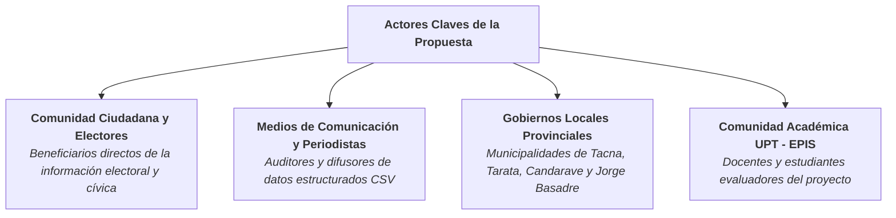
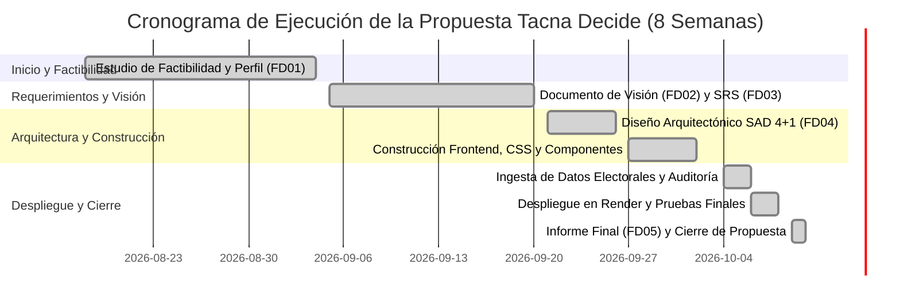

[comment]: 

**UNIVERSIDAD PRIVADA DE TACNA**

**FACULTAD DE INGENIERIA**

**Escuela Profesional de Ingeniería de Sistemas**

 

### **Propuesta del Proyecto *Tacna Decide — Dashboard Electoral y Observatorio de Inteligencia Cívica***

 

**Curso:** *Inteligencia de Negocios (SI-885)*

**Docente:** *Mag. Patrick José Cuadros Quiroga*

**Integrantes:**

***Andia Navarro, Diego Fabrizio (2022073906)***  
***Vargas Candia, Hashira Belén (2022075480)***  
***Platero Maron, Victor Joseph (2022075478)***  
***(Grupo 1)***

 

**Tacna – Perú**

***2026***

**  
**

\pagebreak

   

### **Proyecto**

## ***Tacna Decide — Dashboard Electoral y Observatorio de Inteligencia Cívica, Tacna, 2026***

  

**Presentado por:**

**Andia Navarro, Diego Fabrizio** — *Arquitecto de Software & Diseñador UI/UX*  
**Vargas Candia, Hashira Belén** — *Líder de Proyecto & Especialista en Business Intelligence*  
**Platero Maron, Victor Joseph** — *Desarrollador Front-End & Especialista en QA / DevOps*  

 

**Escuela Profesional de Ingeniería de Sistemas — Universidad Privada de Tacna**

**Fecha:** *06 de octubre de 2026*

  

\pagebreak

|CONTROL DE VERSIONES||||||
| :-: | :- | :- | :- | :- | :- |
|Versión|Hecha por|Revisada por|Aprobada por|Fecha|Motivo|
|1\.0|DFAN / HBVC / VJPM|HBVC|VJPM|06/10/2026|Versión Original|

 

\pagebreak

# **Tabla de contenido**

- [Resumen Ejecutivo](#_resumen_ejecutivo)
- [I Propuesta narrativa](#_propuesta_narrativa)
  - [1. Planteamiento del Problema](#_sec1_1)
  - [2. Justificación del proyecto](#_sec1_2)
  - [3. Objetivo general](#_sec1_3)
  - [4. Beneficios](#_sec1_4)
  - [5. Alcance](#_sec1_5)
  - [6. Requerimientos del sistema](#_sec1_6)
  - [7. Restricciones](#_sec1_7)
  - [8. Supuestos](#_sec1_8)
  - [9. Resultados esperados](#_sec1_9)
  - [10. Metodología de implementación](#_sec1_10)
  - [11. Actores claves](#_sec1_11)
  - [12. Papel y responsabilidades del personal](#_sec1_12)
  - [13. Plan de monitoreo y evaluación](#_sec1_13)
  - [14. Cronograma del proyecto](#_sec1_14)
  - [15. Hitos de entregables](#_sec1_15)
- [II Presupuesto](#_presupuesto)
  - [1. Planteamiento de aplicación del presupuesto](#_sec2_1)
  - [2. Presupuesto](#_sec2_2)
  - [3. Análisis de Factibilidad](#_sec2_3)
  - [4. Evaluación Financiera](#_sec2_4)
- [Anexo 01 – Requerimientos del Sistema Tacna Decide](#_anexo01)

\pagebreak

# **RESUMEN EJECUTIVO**

| **Nombre del Proyecto propuesto:** |
| :--- |
| **Tacna Decide — Dashboard Electoral y Observatorio de Inteligencia Cívica, Tacna, 2026** |
| **Propósito del Proyecto y Resultados esperados:** |
| El propósito del proyecto es dotar a la ciudadanía, investigadores y medios de comunicación del departamento de Tacna de una plataforma web interactiva, ligera y de alta disponibilidad, basada en Inteligencia de Negocios y arquitectura JAMstack, para el seguimiento analítico, transparente y neutral de los resultados preliminares de las Elecciones Regionales y Municipales 2026, integrando en un solo punto de acceso la orientación y servicios cívicos esenciales post-electorales.  **Los resultados esperados son:** • Visualización reactiva en tiempo real de indicadores clave (KPIs): organización líder, brecha matemática con el segundo lugar, total de organizaciones computadas y avance de actas atribuido a la ONPE. • Módulo interactivo de gráficos de barras proporcionales y donuts de avance del escrutinio con cortes horarios auditables. • Herramienta de exportación estructurada de resultados a formato CSV con codificación UTF-8 con BOM. • Catálogo cívico "Servicios para vecinos" con motor de búsqueda diacrítica y filtros temáticos para trámites de multas, candidaturas y dispensas. • Directorio provincial con datos de contacto verificados y marcado telefónico directo (`tel:`) para las municipalidades de Tacna, Tarata, Candarave y Jorge Basadre. • Asistente interactivo de preparación para dispensa electoral con soporte de impresión física en hoja A4 y modo accesible de lectura ampliada (`A+`). |
| **Población Objetivo:** |
| Electores y ciudadanos de la provincia y región de Tacna (más de 300,000 habitantes en las 4 provincias: Tacna, Tarata, Candarave y Jorge Basadre), periodistas, analistas políticos, miembros de mesa y comunidad académica de la Universidad Privada de Tacna. |
| **Monto de Inversión (En Soles):** | **Duración del Proyecto (En Meses):** |
| **S/. 7,180.00** *(Siete mil ciento ochenta con 00/100 Soles)* | **2 meses** *(8 semanas de ejecución)* |

\pagebreak

# **I Propuesta narrativa**

### 1. Planteamiento del Problema

Durante los procesos comiciales en el departamento de Tacna, el acceso a información electoral fidedigna enfrenta serias dificultades originadas por la fragmentación de fuentes, la saturación recurrente de los portales gubernamentales centrales en horas pico y la proliferación de noticias no verificadas en redes sociales. 

La ciudadanía y los medios periodísticos locales suelen recibir porcentajes de votación sin el debido contexto metodológico (desconociendo el avance exacto del cómputo de actas, la brecha porcentual real entre los primeros lugares y la representatividad muestral de las notas de prensa), lo que genera confusión entre cómputos parciales y proclamaciones definitivas de ganadores. Adicionalmente, tras la jornada de sufragio, los electores carecen de un canal digital unificado que los oriente de forma ágil sobre causales de dispensa ante el Jurado Nacional de Elecciones (JNE), verificación de multas y vías de comunicación directa con sus municipalidades provinciales, resultando en trámites engorrosos y desplazamientos físicos evitables.

### 2. Justificación del proyecto

La propuesta se justifica por su alto valor cívico, técnico y económico:
* **Fortalecimiento de la Gobernanza Democrática:** Entrega un observatorio neutral e independiente que combate la desinformación electoral proporcionando datos trazables con fecha, hora de corte y enlace directo a la fuente original.
* **Innovación Tecnológica Eficiente (JAMstack):** Desarrolla una solución basada en estándares abiertos (HTML5, CSS3, JavaScript ES6+ y datasets JSON desacoplados) desplegada en la red perimetral CDN de Render, asegurando tiempos de carga menores a 1 segundo, disponibilidad del 99.9% y costo cero de servidor de producción.
* **Aporte Social Descentralizado:** Facilita la interacción de vecinos de las 4 provincias (Tacna, Tarata, Candarave y Jorge Basadre) con sus autoridades locales mediante directorios telefónicos con enlace directo (`tel:`) y listas de chequeo imprimibles para trámites de dispensa.
* **Alineamiento Académico de Alto Impacto:** Materializa los objetivos formativos del curso de *Inteligencia de Negocios (SI-885)* de la Escuela Profesional de Ingeniería de Sistemas de la UPT, aplicando analítica de datos a una necesidad real regional.

### 3. Objetivo general

Desarrollar, implementar y poner en operación un tablero analítico (Dashboard) web interactivo, estático y de alta disponibilidad para la visualización, monitoreo y contextualización de los resultados parciales de las Elecciones Regionales y Municipales 2026 en Tacna, proveyendo al mismo tiempo un canal unificado de orientación cívica y servicios municipales para la ciudadanía del departamento.

**Objetivos Específicos:**
- **OE1:** Diseñar y estructurar repositorios de datos estáticos en JSON (`data.json` y `citizen.json`) con rigurosa auditoría de fuentes oficiales y canales de atención de las cuatro municipalidades provinciales.
- **OE2:** Construir una interfaz web responsiva y accesible que permita alternar instantáneamente entre la elección para la Alcaldía Provincial de Tacna y la Gobernación Regional de Tacna.
- **OE3:** Implementar componentes visuales de Business Intelligence: cálculo automático de brechas, gráficos de barras proporcionales, donuts de avance del conteo y exportación a archivos CSV.
- **OE4:** Integrar el módulo cívico "Servicios para vecinos", incorporando un motor de búsqueda diacrítica, directorio telefónico y asistente imprimible de dispensas ante el JNE.
- **OE5:** Desplegar la plataforma en la infraestructura de Render Static Sites bajo protocolo HTTPS con certificación SSL/TLS y optimización de rendimiento en red móvil.

### 4. Beneficios

#### Beneficios Tangibles:
* **Ahorro en Horas-Hombre:** Reducción estimada de 40 horas mensuales dedicadas por periodistas, investigadores y ciudadanos a rastrear datos dispersos (valorizado en S/. 1,000.00 al mes).
* **Ahorro en Licenciamiento Tecnológico de BI:** Eliminación de costos recurrentes de licencias de software propietario (como Power BI Pro o Tableau Server), valorizados entre S/. 4,000.00 y S/. 8,000.00 anuales.
* **Ahorro en Desplazamientos Ciudadanos:** El directorio municipal y la guía de requisitos de dispensa ahorran desplazamientos innecesarios a oficinas públicas a cientos de vecinos (ahorro estimado de transporte de S/. 800.00 mensuales).
* *Total de Beneficios Tangibles Proyectados al Año:* **S/. 15,600.00**.

#### Beneficios Intangibles:
* Mayor confianza ciudadana en la transparencia del proceso electoral regional.
* Acceso inclusivo a información pública para adultos mayores gracias al conmutador `A+ Lectura`.
* Posicionamiento institucional de la Universidad Privada de Tacna como referente en innovación tecnológica y compromiso social.
* Neutralidad informativa y reducción de la incertidumbre política post-sufragio.

### 5. Alcance

* **Ámbito Territorial:** Departamento de Tacna (Provincia de Tacna, Tarata, Candarave y Jorge Basadre; 28 distritos).
* **Comicios Considerados:** Elecciones Regionales y Municipales 2026 (Alcalde Provincial de Tacna y Gobernador Regional de Tacna).
* **Módulos Funcionales:**
  1. *Vista General (Resumen):* Tarjetas de KPIs, gráfico de barras, donut de avance, ranking de organizaciones y calendario electoral de octubre 2026.
  2. *Resultados:* Tabla detallada con estados provisionales y botón de exportación CSV con codificación UTF-8 con BOM.
  3. *Servicios para Vecinos:* Buscador interactivo de trámites, filtros temáticos, directorio provincial interactivo y asistente de dispensa con botón de impresión.
  4. *Contexto de Tacna:* Fichas de autoridades vigentes 2023-2026, referencia territorial PCM y notas de calidad sobre el padrón electoral de RENIEC.
  5. *Fuentes y Metodología:* Hipervínculos a los reportes periodísticos y portales oficiales del JNE, ONPE, PCM y Gob.pe.
* **Exclusiones Explícitas:** No incluye captura de DNI ni datos privados en servidor, no realiza cobro de tasas de multas, no efectúa proyecciones estadísticas inferenciales ni conecta en vivo mediante WebSockets hacia los sistemas de la ONPE.

### 6. Requerimientos del sistema

* **Requerimientos Funcionales Esenciales:**
  * Selector dinámico segmentado entre comicio Provincial y Regional.
  * Cálculo reactivo de la brecha porcentual en puntos porcentuales (pp).
  * Renderizado de barras proporcionales en escala referencial al 40%.
  * Gráfico donut con el porcentaje de actas contabilizadas y fecha de corte.
  * Exportador en cliente de matrices tabulares a formato `.csv`.
  * Buscador reactivo normalizado con remoción de tildes y filtrado temático.
  * Selector de municipalidades con enlaces telefónicos directos (`tel:`).
  * Lista de verificación de dispensa con contador reactivo y comando `window.print()`.
  * Modo de accesibilidad visual con conmutador de lectura ampliada (`A+`).
* **Requerimientos No Funcionales:**
  * Tiempo de carga menor a 1.0 segundo (First Contentful Paint < 0.5s).
  * Disponibilidad del 99.9% soportada por la red CDN global de Render.
  * Cifrado obligatorio HTTPS mediante TLS 1.3.
  * Diseño adaptativo para dispositivos móviles, tablets y computadoras (320px a 4K).
  * Cumplimiento de estándares de accesibilidad WAI-ARIA y WCAG 2.1 AA.

### 7. Restricciones

1. **Restricción de Infraestructura:** El sistema opera estrictamente como un Sitio Estático (JAMstack) sin backend activo ni base de datos relacional en producción, entregado a través de Render Static Sites.
2. **Restricción de Privacidad (Ley N° 29733):** Queda prohibida la recolección, registro o almacenamiento de números de DNI, nombres o datos biométricos de los usuarios.
3. **Restricción de Neutralidad Electoral:** El sistema no emite juicios valorativos ni proclama ganadores definitivos, restringiéndose a reflejar con fidelidad matemática los porcentajes reportados.
4. **Restricción de Sincronización en Vivo:** Las actualizaciones se realizan mediante nuevos cortes estructurados en el archivo `data.json` y nuevo build, evitando sobrecargar los servidores de ONPE con peticiones automatizadas recurrentes.

### 8. Supuestos

* Se asume la disponibilidad continua de los reportes oficiales emitidos por ONPE y publicados por medios periodísticos verificados.
* Se asume que los usuarios finales disponen de navegadores modernos con soporte para JavaScript ES6 y hojas de estilo CSS3.
* Se asume la estabilidad operativa de los servicios de alojamiento en la nube de Render y GitHub.
* Se asume que las URLs institucionales del Estado Peruano (`gob.pe`, `jne.gob.pe`, `onpe.gob.pe`) mantienen su vigencia y accesibilidad.

### 9. Resultados esperados

1. Disponibilidad pública de un observatorio electoral moderno, neutral y accesible para toda la población tacneña.
2. Consulta ágil y comprensión clara de las tendencias del escrutinio en menos de 5 segundos de interacción.
3. Descarga autónoma de datos estructurados en formato CSV para investigadores y periodistas.
4. Reducción en los tiempos de orientación y traslado vecinal para trámites de dispensa y contacto municipal en las 4 provincias.
5. Cero incidencias de seguridad y cero costos de mantenimiento de servidor durante el ciclo de vida del proyecto.

### 10. Metodología de implementación

Se adopta una metodología híbrida basada en **prácticas ágiles combinadas con el marco RUP (Rational Unified Process)**:
* **Fase de Inicio (Semanas 1-2):** Levantamiento de información, definición de actores, análisis de fuentes y elaboración del Informe de Factibilidad (FD01).
* **Fase de Elaboración (Semanas 3-4):** Formulación del Documento de Visión (FD02) y Especificación de Requerimientos de Software SRS (FD03), diseño del esquema JSON de datos y wireframes visuales.
* **Fase de Construcción (Semanas 5-6):** Diseño de la Arquitectura de Software SAD 4+1 (FD04), codificación HTML5/CSS3/JS Vanilla, desarrollo de componentes analíticos y motor de búsqueda cívico.
* **Fase de Transición y Despliegue (Semanas 7-8):** Ingesta de los cortes electorales post-jornada del 4 de octubre, validación cruzada de datos, despliegue continuo en Render, pruebas de rendimiento y elaboración del Informe Final (FD05).

### 11. Actores claves

### 12. Papel y responsabilidades del personal

El equipo técnico del proyecto se organiza bajo la siguiente matriz de responsabilidades (RACI):

| Actividad / Entregable | Diego Andia Navarro | Hashira Vargas Candia | Victor Platero Maron |
| :--- | :---: | :---: | :---: |
| Dirección y Planificación del Proyecto | C | **R / A** | C |
| Recolección y Curaduría de Datasets (`data.json`) | C | **R / A** | I |
| Arquitectura de Software y Modelado 4+1 (FD04) | **R / A** | C | C |
| Diseño de Interfaz y Experiencia de Usuario (UI/UX) | **R / A** | C | C |
| Desarrollo Frontend y Gráficos Analíticos | C | C | **R / A** |
| Motor de Búsqueda Cívico y Directorio (`citizen.json`) | C | C | **R / A** |
| Pipeline de Compilación Node.js y Despliegue en Render | C | I | **R / A** |
| Pruebas de Calidad, Rendimiento y Validación Final | **R** | **R** | **R / A** |

*(R: Responsable ejecutor, A: Aprobador final, C: Consultado, I: Informado)*

### 13. Plan de monitoreo y evaluación

El seguimiento y control del proyecto se rige por indicadores clave de gestión técnica:
1. **Indicador de Rendimiento Web:** Puntuación de Google Lighthouse superior a 95 puntos en rendimiento, accesibilidad y mejores prácticas.
2. **Indicador de Disponibilidad:** Registro de Uptime del 99.9% verificado en la consola de Render.
3. **Indicador de Precisión de Datos:** Concordancia del 100% de los datos visualizados contra los reportes fuente de El Comercio y la ONPE.
4. **Indicador de Calidad de Código:** Cero errores de sintaxis en consola y validación estricta de sintaxis JSON.

### 14. Cronograma del proyecto

### 15. Hitos de entregables

* **Hito 1 (Fin Semana 2):** Aprobación del Estudio de Factibilidad (FD01) y viabilidad financiera.
* **Hito 2 (Fin Semana 4):** Aprobación del Documento de Visión (FD02) y Especificación de Requerimientos SRS (FD03).
* **Hito 3 (Fin Semana 6):** Culminación del Documento de Arquitectura SAD 4+1 (FD04) y prototipo interactivo funcional.
* **Hito 4 (Fin Semana 7):** Ingesta de datos del proceso electoral del 4 de octubre y despliegue del Sitio Estático en Render.
* **Hito 5 (Fin Semana 8):** Aprobación del Informe Final del Proyecto (FD05) y la presente Propuesta de Proyecto (FD06).

\pagebreak

# **II Presupuesto**

### 1. Planteamiento de aplicación del presupuesto

El presupuesto del proyecto ha sido planteado bajo un principio de **máxima optimización y austeridad financiera**, aprovechando el modelo arquitectónico de sitios estáticos para reducir a cero los costos de servidores dedicados y bases de datos en la nube. La inversión se focaliza esencialmente en la retribución de horas profesionales del equipo multidisciplinario de desarrollo y en los servicios operativos elementales para la formulación y validación del producto.

### 2. Presupuesto

| Categoría de Gasto | Descripción Detallada | Monto Estimado (S/.) | Porcentaje (%) |
| :--- | :--- | :---: | :---: |
| **Recursos Humanos (Personal)** | Honorarios de 3 especialistas de sistemas (80 horas cada uno a S/. 25.00/hora) | S/. 6,000.00 | 83.57 % |
| **Servicios Operativos** | Consumo de internet de alta velocidad, fluido eléctrico y telefonía celular (2 meses) | S/. 420.00 | 5.85 % |
| **Materiales y Equipos** | Materiales de escritorio, resmas de papel bond y depreciación de laptops | S/. 450.00 | 6.27 % |
| **Infraestructura Cloud** | Plataforma Render Static Sites con CDN global, SSL Let's Encrypt y GitHub | S/. 0.00 | 0.00 % |
| **Subtotal Directo** | | **S/. 6,870.00** | **95.69 %** |
| **Imprevistos y Contingencias (5%)** | Fondo de reserva técnica para imprevistos | S/. 310.00 | 4.31 % |
| **Presupuesto Total del Proyecto** | | **S/. 7,180.00** | **100.00 %** |

### 3. Análisis de Factibilidad

El análisis de factibilidad demostró que la propuesta es completamente alcanzable:
* **Técnica:** Arquitectura comprobada sin dependencias complejas, rápida de ejecutar y mantener.
* **Operativa:** Modelo de mantenimiento intuitivo mediante edición de archivos JSON y sincronización Git.
* **Social:** Alto impacto comunitario, neutralidad garantizada y herramientas de inclusión cívica.
* **Legal:** Conformidad estricta con la legislación de datos abiertos y privacidad ciudadana.
* **Ambiental:** Nula generación de residuos físicos y consumo energético mínimo.

### 4. Evaluación Financiera

Para un horizonte de evaluación de 12 meses, contrastando la inversión inicial con los beneficios tangibles generados:
* **Costo de Oportunidad del Capital (COK):** **12.00%** anual.
* **Relación Beneficio / Costo (B/C):** **1.56** ($> 1$, altamente rentable).
* **Valor Actual Neto (VAN):** **+S/. 5,305.00** ($> 0$, agrega valor económico positivo).
* **Tasa Interna de Retorno (TIR):** **44.50%** ($> \text{COK}$, proyecto financieramente viable).

\pagebreak

# **Anexo 01 – Requerimientos del Sistema Tacna Decide**

A continuación se resume la matriz de requerimientos del sistema especificada formalmente en el SRS (FD03):

| Código | Requerimiento del Sistema | Tipo | Descripción y Criterio de Aceptación |
| :---: | :--- | :---: | :--- |
| **RF-01** | Visualización Elección Municipal | Funcional | Muestra métricas de la Alcaldía Provincial de Tacna, identificando al líder y las 5 agrupaciones principales. |
| **RF-02** | Visualización Elección Regional | Funcional | Muestra métricas de la Gobernación Regional de Tacna con sus respectivas agrupaciones políticas. |
| **RF-03** | Cálculo Automático de Brecha | Funcional | Computa la diferencia matemática en puntos porcentuales entre la primera y segunda organización política. |
| **RF-04** | Gráficos Proporcionales de Barras | Funcional | Renderiza barras CSS horizontales relativas al porcentaje de votos reportado en escala referencial al 40%. |
| **RF-05** | Donut de Avance de Conteo | Funcional | Dibuja un gráfico circular en gradiente cónico con el avance del escrutinio atribuido a ONPE y el corte horario. |
| **RF-06** | Exportador Tabular a CSV | Funcional | Permite la descarga en memoria del archivo `tacna-[cargo]-2026.csv` con BOM UTF-8 compatible con Excel. |
| **RF-07** | Buscador Cívico Diacrítico | Funcional | Motor de búsqueda sobre `citizen.json` insensible a mayúsculas y acentos que filtra trámites instantáneamente. |
| **RF-08** | Directorio Provincial con Marcado | Funcional | Despliega datos de sede, horarios y botones enlazados `tel:` para las 4 municipalidades provinciales de Tacna. |
| **RF-09** | Checklist de Dispensa e Impresión | Funcional | Asistente de 4 pasos con contador interactivo y hoja de estilos `@media print` para impresión física limpia. |
| **RF-10** | Conmutador Accesible A+ | Funcional | Conmuta la clase `large-reading` para aumentar el tamaño de textos sin alterar el diseño responsivo. |
| **RNF-01** | Rendimiento y Tiempo de Carga | No Funcional | Tiempo interactivo total menor a 1.0 segundo y First Contentful Paint < 0.5 segundos. |
| **RNF-02** | Alta Disponibilidad del Servicio | No Funcional | Disponibilidad del 99.9% a través de la red perimetral global CDN de Render Static Sites. |
| **RNF-03** | Seguridad en la Transferencia | No Funcional | Cifrado forzado HTTPS con certificados TLS 1.3 gestionados por Let's Encrypt. |
| **RNF-04** | Privacidad y Protección de Datos | No Funcional | Prohibición absoluta de recolectar números de DNI o datos personales en el servidor (Ley N° 29733). |
| **RNF-05** | Compatibilidad y Diseño Adaptable | No Funcional | Diseño adaptable líquido desde 320px hasta 4K, compatible con Chrome, Firefox, Safari y Edge. |
